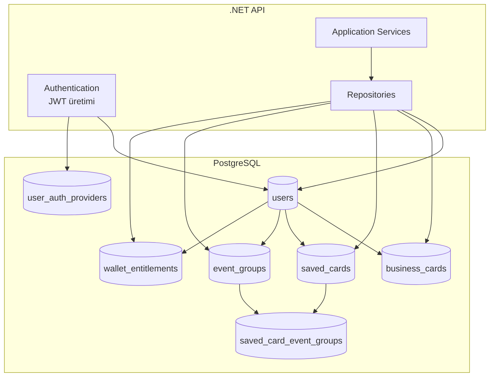
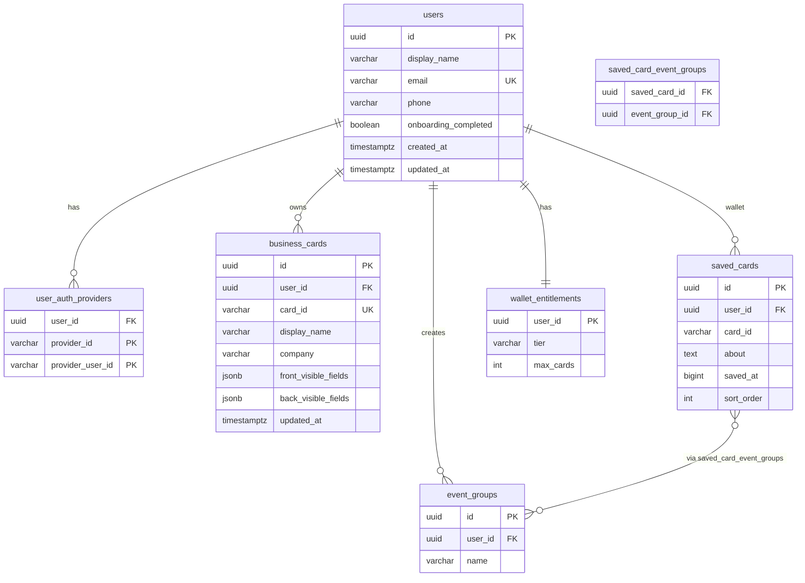

# Cardence Veritabanı Tasarım Dokümantasyonu

Bu doküman, Cardence .NET backend servisinin **PostgreSQL** veritabanı kurgusunu tanımlar: tablolar, ilişkiler, auth bağlantısı, iş kuralları ve Flutter eşlemesi.

**İlgili dokümanlar:**

| Doküman | İçerik |
|---------|--------|
| [database-design.md](./database-design.md) | **Bu dosya** — DB şeması, ilişkiler, migration |
| [dotnet-backend-api.md](./dotnet-backend-api.md) | API endpoint'leri, DTO'lar |
| [backend-development.md](./backend-development.md) | Kurulum, Cursor, geliştirme fazları |

---

## İçindekiler

1. [Neden veritabanı?](#1-neden-veritabanı)
2. [Teknoloji seçimi](#2-teknoloji-seçimi)
3. [Mimari genel bakış](#3-mimari-genel-bakış)
4. [Auth ve veritabanı ilişkisi](#4-auth-ve-veritabanı-ilişkisi)
5. [Kavramsal model](#5-kavramsal-model)
6. [ER diyagramı](#6-er-diyagramı)
7. [Tablo referansı](#7-tablo-referansı)
8. [İndeksler ve kısıtlar](#8-indeksler-ve-kısıtlar)
9. [Cascade ve silme davranışları](#9-cascade-ve-silme-davranışları)
10. [Veri akışları](#10-veri-akışları)
11. [Flutter ↔ DB eşlemesi](#11-flutter--db-eşlemesi)
12. [EF Core implementasyonu](#12-ef-core-implementasyonu)
13. [Ortam ve bağlantı](#13-ortam-ve-bağlantı)
14. [Migration stratejisi](#14-migration-stratejisi)
15. [Uygulama durumu ve roadmap](#15-uygulama-durumu-ve-roadmap)

---

## 1. Neden veritabanı?

Cardence Flutter uygulaması bugün **offline-first** (`SharedPreferences`). Backend ile birlikte **source of truth** veritabanı olur.

| Senaryo | DB gerekli mi? |
|---------|----------------|
| Tek cihaz, local demo | Hayır |
| QR içinde tam JSON, sunucu yok | Hayır |
| Kullanıcı girişi + çok cihaz senkron | **Evet** |
| `cardId` ile public kart çözümleme | **Evet** |
| Cüzdan kotası (15 / 200) | **Evet** |
| Etkinlik grubu + kart bağlantısı | **Evet** |
| Premium abonelik | **Evet** |

**Özet:** Production Cardence backend için kalıcı veritabanı **zorunludur**.

---

## 2. Teknoloji seçimi

| Bileşen | Seçim | Gerekçe |
|---------|-------|---------|
| Veritabanı | **PostgreSQL 16** | İlişkisel model, JSONB, güvenilir transaction |
| ORM | **EF Core 8+** | Mevcut `CardenceDbContext`, migration desteği |
| Geliştirme fallback | **In-memory DB** | PostgreSQL yokken hızlı local test |
| Connection | `Npgsql` | .NET PostgreSQL driver |

```
Cardence.Api
    └── Cardence.Infrastructure
            └── Persistence/
                    ├── CardenceDbContext.cs
                    ├── Configurations/
                    └── Migrations/          (planlanan)
```

---

## 3. Mimari genel bakış



**Prensipler:**

1. Her kullanıcıya özel veri `user_id` ile filtrelenir (JWT `sub` claim).
2. `business_cards.card_id` **global unique** — QR paylaşım kimliği.
3. `saved_cards.card_id` aynı public ID'yi **referans** alır; kullanıcı başına unique `(user_id, card_id)`.
4. `BusinessCard` ≠ `SavedCard` — farklı tablolar, farklı yaşam döngüsü.

---

## 4. Auth ve veritabanı ilişkisi

Auth **veritabanında oturum tutmaz** (stateless JWT). DB'de **kullanıcı kimliği** saklanır.

### 4.1 Akış

```
1. Client → POST /LoginWithGoogle { idToken }
2. Backend → Google token doğrula
3. Backend → user_auth_providers + users tablosunda kullanıcı bul/oluştur
4. Backend → JWT üret (claims: sub = users.id)
5. Client  → Sonraki isteklerde Authorization: Bearer {jwt}
6. API     → CurrentUserService.UserId → repository filtreleri
```

### 4.2 JWT claim → DB

| JWT claim | DB karşılığı |
|-----------|--------------|
| `sub` | `users.id` (UUID) |
| `email` | `users.email` (opsiyonel claim) |

### 4.3 Authentication akışları (mevcut)

| Endpoint | DB etkisi |
|----------|-----------|
| `POST /Authentication` | `users` kaydı yoksa `email` ile oluşturur; JWT + refresh token döner |
| `POST /LoginWithPhone` | `otpCode` ile doğrulandığında `users` kaydı yoksa `phone` ile oluşturur |
| `POST /LoginWithEmail` | `otpCode` ile doğrulandığında `users` kaydı yoksa `email` ile oluşturur |
| `POST /RefreshAuthentication` | Refresh token doğrulanır; yeni access token üretilir |

OTP kodları şu an bellek içi (`InMemoryAuthTokenStore`); production'da ayrı tablo veya cache kullanılmalıdır.

### 4.4 Tablolar

| Tablo | Auth rolü |
|-------|-----------|
| `users` | Hesap kökü; tüm verinin sahibi |
| `user_auth_providers` | Google/Apple/Phone/LinkedIn eşlemesi (planlanan) |

---

## 5. Kavramsal model

### 5.1 Domain kavramları

| Kavram | Tablo | Açıklama |
|--------|-------|----------|
| **User** | `users` | Giriş yapan hesap |
| **BusinessCard** | `business_cards` | Kullanıcının **kendi** dijital kartviziti |
| **SavedCard** | `saved_cards` | Başkasından alınan kartın **cüzdan kopyası** |
| **EventGroup** | `event_groups` | Etkinlik / networking grubu |
| **WalletEntitlement** | `wallet_entitlements` | Free / Premium kota |
| **CardSharePayload** | — (DTO) | QR çıktısı; `business_cards`'tan türetilir |

### 5.2 Kritik ayrımlar

```
BusinessCard                    SavedCard
─────────────────              ─────────────────
Sahibi: users.id             Sahibi: users.id (cüzdan sahibi)
card_id: global unique       card_id: referans (aynı public ID olabilir)
Profil + tasarım             Profil kopyası + kullanıcı notu (about)
QR kaynağı                   QR/ID ile eklenir
EventGroup'a BAĞLANMAZ       EventGroup'a bağlanır
```

### 5.3 Public lookup (auth yok)

`GET /PublicBusinessCardShare?cardId=` → `business_cards` tablosunda `card_id` ile arama. Auth gerekmez; yalnızca paylaşıma açık alanlar döner.

---

## 6. ER diyagramı



---

## 7. Tablo referansı

### 7.1 `users` — Hesap

| Kolon | Tip | Null | Açıklama |
|-------|-----|------|----------|
| `id` | `UUID` | PK | Sunucu üretir |
| `display_name` | `VARCHAR(200)` | ✓ | Görünen ad |
| `email` | `VARCHAR(320)` | ✓ | Unique; Authentication / OAuth |
| `phone` | `VARCHAR(20)` | ✓ | E.164 |
| `onboarding_completed` | `BOOLEAN` | ✗ | Default `false` |
| `created_at` | `TIMESTAMPTZ` | ✗ | |
| `updated_at` | `TIMESTAMPTZ` | ✗ | |

**EF entity:** `Cardence.Domain.Entities.User`  
**Durum:** ✅ Uygulandı (`UserConfiguration`)

---

### 7.2 `user_auth_providers` — OAuth eşlemesi

| Kolon | Tip | Null | Açıklama |
|-------|-----|------|----------|
| `user_id` | `UUID` | FK → `users` | |
| `provider_id` | `VARCHAR(50)` | PK* | `google.com`, `apple.com`, `phone`, `linkedin.com` |
| `provider_user_id` | `VARCHAR(200)` | PK* | Provider'daki kullanıcı ID |

**Composite PK:** `(provider_id, provider_user_id)`

**Durum:** ⏳ Planlanan (Faz 1 — Google/Apple login)

---

### 7.3 `business_cards` — Kendi kartlarım

| Kolon | Tip | Null | Açıklama |
|-------|-----|------|----------|
| `id` | `UUID` | PK | Internal ID |
| `user_id` | `UUID` | FK → `users` | Kart sahibi |
| `card_id` | `VARCHAR(36)` | UK | **Global QR kimliği** (UUID v4) |
| `card_name` | `VARCHAR(200)` | ✓ | Liste başlığı |
| `display_name` | `VARCHAR(200)` | ✓ | Ad soyad |
| `email` | `VARCHAR(320)` | ✓ | |
| `phone` | `VARCHAR(20)` | ✓ | |
| `company` | `VARCHAR(200)` | ✓ | |
| `title` | `VARCHAR(200)` | ✓ | Pozisyon |
| `website` | `VARCHAR(500)` | ✓ | |
| `linkedin` | `VARCHAR(500)` | ✓ | |
| `skills` | `TEXT` | ✓ | Virgülle ayrılmış |
| `school` | `VARCHAR(200)` | ✓ | |
| `about` | `TEXT` | ✓ | Hakkımda |
| `front_visible_fields` | `JSONB` | ✗ | Default `[]`, max 3 alan |
| `back_visible_fields` | `JSONB` | ✗ | Default `[]`, max 3 alan |
| `accent_color` | `VARCHAR(7)` | ✓ | `#RRGGBB` |
| `background_color` | `VARCHAR(7)` | ✓ | `#RRGGBB` |
| `last_used_palette_background_color` | `VARCHAR(7)` | ✓ | |
| `created_at` | `TIMESTAMPTZ` | ✗ | |
| `updated_at` | `TIMESTAMPTZ` | ✗ | |

**EF entity:** `Cardence.Domain.Entities.BusinessCard`  
**Durum:** ✅ Uygulandı (temel alanlar) — `front_visible_fields` / `back_visible_fields` JSONB ⏳ eklenecek

**İş kuralları:**
- `card_id` global unique
- Kullanıcı yalnızca kendi `user_id` kartlarını CRUD eder
- `linkedEventGroupIds` bu tabloda **yok** (BusinessCard gruplara bağlanmaz)

---

### 7.4 `saved_cards` — Cüzdan

| Kolon | Tip | Null | Açıklama |
|-------|-----|------|----------|
| `id` | `UUID` | PK | |
| `user_id` | `UUID` | FK → `users` | Cüzdan sahibi |
| `card_id` | `VARCHAR(36)` | ✗ | Public referans (`business_cards.card_id`) |
| `display_name` | `VARCHAR(200)` | ✓ | Kopya / hydrate |
| `email` | `VARCHAR(320)` | ✓ | |
| `phone` | `VARCHAR(20)` | ✓ | |
| `company` | `VARCHAR(200)` | ✓ | |
| `title` | `VARCHAR(200)` | ✓ | |
| `website` | `VARCHAR(500)` | ✓ | |
| `linkedin` | `VARCHAR(500)` | ✓ | |
| `skills` | `TEXT` | ✓ | |
| `school` | `VARCHAR(200)` | ✓ | |
| `about` | `TEXT` | ✓ | **Kullanıcı notu** (Flutter `SavedCard.about`) |
| `saved_at` | `BIGINT` | ✗ | Unix epoch **milliseconds** |
| `sort_order` | `INT` | ✗ | Sürükle-bırak sırası, default `0` |

**Unique:** `(user_id, card_id)` — aynı kart cüzdana iki kez eklenemez

**Durum:** ⏳ Planlanan (Faz 2)

**İş kuralları:**
- Eklemeden önce `wallet_entitlements` kotası kontrol edilir
- `dummy-*` ID'ler persist edilmez
- Stub kayıt: yalnızca `card_id` ile oluşturulabilir; profil public endpoint'ten hydrate edilebilir

---

### 7.5 `event_groups` — Etkinlik grupları

| Kolon | Tip | Null | Açıklama |
|-------|-----|------|----------|
| `id` | `UUID` | PK | |
| `user_id` | `UUID` | FK → `users` | |
| `name` | `VARCHAR(200)` | ✗ | |
| `created_at` | `TIMESTAMPTZ` | ✗ | |

**Unique:** `(user_id, LOWER(name))` — case-insensitive duplicate yasak

**Durum:** ⏳ Planlanan (Faz 3)

---

### 7.6 `saved_card_event_groups` — M:N bağlantı

| Kolon | Tip | Null | Açıklama |
|-------|-----|------|----------|
| `saved_card_id` | `UUID` | FK → `saved_cards` | |
| `event_group_id` | `UUID` | FK → `event_groups` | |

**Composite PK:** `(saved_card_id, event_group_id)`

Flutter `SavedCard.linkedEventGroupIds` API'de JSON array; DB'de normalize join tablosu.

**Durum:** ⏳ Planlanan (Faz 3)

---

### 7.7 `wallet_entitlements` — Kota / plan

| Kolon | Tip | Null | Açıklama |
|-------|-----|------|----------|
| `user_id` | `UUID` | PK, FK → `users` | |
| `tier` | `VARCHAR(20)` | ✗ | `free` \| `premium` |
| `max_cards` | `INT` | ✗ | Free: 15, Premium: 200 |
| `updated_at` | `TIMESTAMPTZ` | ✗ | |

**Durum:** ⏳ Planlanan (Faz 4)

**Kota hesabı:**
```sql
SELECT COUNT(*) FROM saved_cards WHERE user_id = :userId;
-- usedCount < max_cards ise ekleme izni
```

---

## 8. İndeksler ve kısıtlar

| Tablo | İndeks / Kısıt | Amaç |
|-------|----------------|------|
| `users` | `UNIQUE (email)` | Tek email = tek hesap |
| `business_cards` | `UNIQUE (card_id)` | Global QR kimliği |
| `business_cards` | `(user_id, card_id)` | Kullanıcı kart sorgusu |
| `saved_cards` | `UNIQUE (user_id, card_id)` | Duplicate engeli |
| `saved_cards` | `(user_id, sort_order)` | Liste sıralama |
| `event_groups` | `UNIQUE (user_id, LOWER(name))` | Duplicate grup adı |
| `user_auth_providers` | `PK (provider_id, provider_user_id)` | OAuth tekilliği |

---

## 9. Cascade ve silme davranışları

| Olay | Davranış |
|------|----------|
| `users` silindi | CASCADE → `business_cards`, `saved_cards`, `event_groups`, `wallet_entitlements`, `user_auth_providers` |
| `business_cards` silindi | Public QR artık 404; cüzdandaki `saved_cards` **silinmez** (bağımsız kopya) |
| `event_groups` silindi | CASCADE → `saved_card_event_groups`; saved card kayıtları kalır |
| `saved_cards` silindi | CASCADE → `saved_card_event_groups` |

**EventGroup silme (uygulama katmanı):** Flutter'da grup silinince tüm `saved_cards` üzerindeki `linkedEventGroupIds` temizlenir. Backend join tablosunda CASCADE yeterli.

---

## 10. Veri akışları

### 10.1 Kendi kart kaydetme

```
POST /SaveBusinessCard + JWT
  → sub → users.id
  → INSERT business_cards (user_id, card_id, profil alanları)
```

### 10.2 QR paylaşım

```
Sahip:  GET /BusinessCardShare?cardId=     (JWT + ownership)
Herkes: GET /PublicBusinessCardShare?cardId=  (auth yok)
  → SELECT * FROM business_cards WHERE card_id = :cardId
  → CardSharePayload DTO (kısa anahtarlar: id, n, e, ...)
```

### 10.3 Cüzdana ekleme

```
POST /SaveSavedCard + JWT
  1. COUNT saved_cards WHERE user_id = :uid  → kota kontrolü
  2. EXISTS (user_id, card_id)               → duplicate kontrolü
  3. Opsiyonel: SELECT business_cards WHERE card_id = :id → hydrate
  4. INSERT saved_cards
```

### 10.4 Giriş (OAuth)

```
POST /LoginWithGoogle
  1. Token doğrula
  2. UPSERT user_auth_providers
  3. UPSERT users
  4. INSERT wallet_entitlements (yoksa, tier=free)
  5. JWT döndür
```

---

## 11. Flutter ↔ DB eşlemesi

| Flutter entity / model | DB tablo | Not |
|------------------------|----------|-----|
| `OnboardingCardDraft` | `business_cards` | `cardId` → `card_id` |
| `OnboardingCardDraftModel.toJson()` | `business_cards` kolonları | camelCase ↔ snake_case |
| `SavedCard` | `saved_cards` | `about` = kullanıcı notu |
| `SavedCardModel` | `saved_cards` | `savedAt` → `saved_at` (bigint ms) |
| `EventGroup` | `event_groups` | |
| `linkedEventGroupIds` | `saved_card_event_groups` | API'de array, DB'de join |
| `WalletPlanTier` | `wallet_entitlements.tier` | |
| `CardSharePayload` | — | `business_cards` satırından üretilir |
| `ThemePreference` | — | DB'ye gitmez (cihaz-local) |

### Kolon adı dönüşümü

| Flutter / API (camelCase) | PostgreSQL (snake_case) |
|---------------------------|-------------------------|
| `displayName` | `display_name` |
| `cardId` | `card_id` |
| `frontVisibleFields` | `front_visible_fields` |
| `savedAt` | `saved_at` |
| `linkedEventGroupIds` | `saved_card_event_groups` (join) |

---

## 12. EF Core implementasyonu

### 12.1 Mevcut DbContext

```csharp
public sealed class CardenceDbContext : DbContext
{
    public DbSet<User> Users => Set<User>();
    public DbSet<BusinessCard> BusinessCards => Set<BusinessCard>();
    // Faz 2+: SavedCards, EventGroups, WalletEntitlements
}
```

### 12.2 Configuration pattern

Her entity için `IEntityTypeConfiguration<T>`:

```
Infrastructure/Persistence/Configurations/
├── UserConfiguration.cs           ✅
├── BusinessCardConfiguration.cs   ✅
├── SavedCardConfiguration.cs      ⏳
├── EventGroupConfiguration.cs     ⏳
└── WalletEntitlementConfiguration.cs ⏳
```

### 12.3 Repository → tablo

| Repository | Tablo(lar) |
|------------|------------|
| `IUserRepository` | `users` |
| `IBusinessCardRepository` | `business_cards` |
| `ISavedCardRepository` *(planlanan)* | `saved_cards` |
| `IEventGroupRepository` *(planlanan)* | `event_groups`, `saved_card_event_groups` |
| `IWalletRepository` *(planlanan)* | `wallet_entitlements`, `saved_cards` (count) |

### 12.4 JSONB alanlar

`front_visible_fields` ve `back_visible_fields` PostgreSQL `JSONB` olarak saklanır:

```json
["company", "title", "email"]
```

EF Core mapping:

```csharp
builder.Property(x => x.FrontVisibleFields)
    .HasColumnType("jsonb")
    .HasConversion(/* string[] ↔ json */);
```

---

## 13. Ortam ve bağlantı

### 13.1 Connection string

`appsettings.Development.json`:

```json
{
  "ConnectionStrings": {
    "Default": "Host=localhost;Port=5432;Database=cardence;Username=postgres;Password=dev"
  }
}
```

### 13.2 Docker (local PostgreSQL)

`backend/database/docker-compose.yml` kullanılır. Detay: [docker.md](./docker.md)

```bash
cd backend/database
cp .env.example .env
docker compose up -d
```

### 13.3 In-memory fallback

`Database:UseInMemory = true` veya connection string boşsa → EF InMemory database (`CardenceDev`).  
Hızlı geliştirme içindir; production'da **PostgreSQL** kullanılır.

### 13.4 Ortam matrisi

| Ortam | Veritabanı | Oluşturma |
|-------|------------|-----------|
| Local dev | PostgreSQL Docker | `dotnet ef database update` |
| Local hızlı test | In-memory | `EnsureCreatedAsync()` (mevcut) |
| Staging / Prod | Managed PostgreSQL | Migration pipeline |

---

## 14. Migration stratejisi

### 14.1 Komutlar

```bash
cd backend

# Migration oluştur
dotnet ef migrations add <Name> \
  --project Cardence.Infrastructure \
  --startup-project Cardence.Api

# Uygula
dotnet ef database update \
  --project Cardence.Infrastructure \
  --startup-project Cardence.Api
```

### 14.2 Faz bazlı migration planı

| Migration | İçerik | Faz |
|-----------|--------|-----|
| `InitialUsersAndBusinessCards` | `users`, `business_cards` | ✅ (EnsureCreated / planlanan migration) |
| `AddVisibleFieldsJsonb` | `front_visible_fields`, `back_visible_fields` | Faz 1 |
| `AddUserAuthProviders` | `user_auth_providers` | Faz 1 |
| `AddSavedCardsAndWallet` | `saved_cards`, `wallet_entitlements` | Faz 2 |
| `AddEventGroups` | `event_groups`, `saved_card_event_groups` | Faz 3 |

### 14.3 Tam SQL şeması (hedef)

```sql
-- users
CREATE TABLE users (
    id              UUID PRIMARY KEY DEFAULT gen_random_uuid(),
    display_name    VARCHAR(200),
    email           VARCHAR(320) UNIQUE,
    phone           VARCHAR(20),
    onboarding_completed BOOLEAN NOT NULL DEFAULT FALSE,
    created_at      TIMESTAMPTZ NOT NULL DEFAULT NOW(),
    updated_at      TIMESTAMPTZ NOT NULL DEFAULT NOW()
);

-- oauth
CREATE TABLE user_auth_providers (
    user_id           UUID NOT NULL REFERENCES users(id) ON DELETE CASCADE,
    provider_id       VARCHAR(50) NOT NULL,
    provider_user_id  VARCHAR(200) NOT NULL,
    PRIMARY KEY (provider_id, provider_user_id)
);

-- kendi kartlar
CREATE TABLE business_cards (
    id              UUID PRIMARY KEY DEFAULT gen_random_uuid(),
    user_id         UUID NOT NULL REFERENCES users(id) ON DELETE CASCADE,
    card_id         VARCHAR(36) NOT NULL UNIQUE,
    card_name       VARCHAR(200),
    display_name    VARCHAR(200),
    email           VARCHAR(320),
    phone           VARCHAR(20),
    company         VARCHAR(200),
    title           VARCHAR(200),
    website         VARCHAR(500),
    linkedin        VARCHAR(500),
    skills          TEXT,
    school          VARCHAR(200),
    about           TEXT,
    front_visible_fields JSONB NOT NULL DEFAULT '[]',
    back_visible_fields  JSONB NOT NULL DEFAULT '[]',
    accent_color    VARCHAR(7),
    background_color VARCHAR(7),
    last_used_palette_background_color VARCHAR(7),
    created_at      TIMESTAMPTZ NOT NULL DEFAULT NOW(),
    updated_at      TIMESTAMPTZ NOT NULL DEFAULT NOW()
);

CREATE INDEX ix_business_cards_user_id_card_id ON business_cards (user_id, card_id);

-- cüzdan kotası
CREATE TABLE wallet_entitlements (
    user_id     UUID PRIMARY KEY REFERENCES users(id) ON DELETE CASCADE,
    tier        VARCHAR(20) NOT NULL DEFAULT 'free',
    max_cards   INT NOT NULL DEFAULT 15,
    updated_at  TIMESTAMPTZ NOT NULL DEFAULT NOW()
);

-- kayıtlı kartlar
CREATE TABLE saved_cards (
    id              UUID PRIMARY KEY DEFAULT gen_random_uuid(),
    user_id         UUID NOT NULL REFERENCES users(id) ON DELETE CASCADE,
    card_id         VARCHAR(36) NOT NULL,
    display_name    VARCHAR(200),
    email           VARCHAR(320),
    phone           VARCHAR(20),
    company         VARCHAR(200),
    title           VARCHAR(200),
    website         VARCHAR(500),
    linkedin        VARCHAR(500),
    skills          TEXT,
    school          VARCHAR(200),
    about           TEXT,
    saved_at        BIGINT NOT NULL,
    sort_order      INT NOT NULL DEFAULT 0,
    UNIQUE (user_id, card_id)
);

CREATE INDEX ix_saved_cards_user_sort ON saved_cards (user_id, sort_order);

-- etkinlik grupları
CREATE TABLE event_groups (
    id          UUID PRIMARY KEY DEFAULT gen_random_uuid(),
    user_id     UUID NOT NULL REFERENCES users(id) ON DELETE CASCADE,
    name        VARCHAR(200) NOT NULL,
    created_at  TIMESTAMPTZ NOT NULL DEFAULT NOW()
);

CREATE UNIQUE INDEX ux_event_groups_user_name
    ON event_groups (user_id, LOWER(name));

-- m:n bağlantı
CREATE TABLE saved_card_event_groups (
    saved_card_id    UUID NOT NULL REFERENCES saved_cards(id) ON DELETE CASCADE,
    event_group_id   UUID NOT NULL REFERENCES event_groups(id) ON DELETE CASCADE,
    PRIMARY KEY (saved_card_id, event_group_id)
);
```

---

## 15. Uygulama durumu ve roadmap

| Tablo / Özellik | EF Entity | Migration | Repository | API |
|-----------------|-----------|-----------|------------|-----|
| `users` | ✅ | EnsureCreated | ✅ `UserRepository` | `/Authentication` |
| `business_cards` | ✅ | EnsureCreated | ✅ `BusinessCardRepository` | `/BusinessCards`… |
| `front/back_visible_fields` | ⏳ | ⏳ | — | — |
| `user_auth_providers` | ⏳ | ⏳ | ⏳ | `/LoginWithGoogle`… |
| `saved_cards` | ⏳ | ⏳ | ⏳ | `/SavedCards`… |
| `wallet_entitlements` | ⏳ | ⏳ | ⏳ | `/WalletQuota` |
| `event_groups` | ⏳ | ⏳ | ⏳ | `/EventGroups`… |
| `saved_card_event_groups` | ⏳ | ⏳ | ⏳ | `/LinkEventGroupCards`… |

### Önerilen sıra

1. EF migration'a geç (`EnsureCreated` → `dotnet ef migrations`)
2. `front_visible_fields` / `back_visible_fields` JSONB ekle
3. `user_auth_providers` + OAuth login
4. `saved_cards` + `wallet_entitlements`
5. `event_groups` + join tablosu

---

## Doküman seti özeti

| Dosya | Rol |
|-------|-----|
| `backend/docs/database-design.md` | Veritabanı tasarımı — bu dosya |
| `backend/docs/dotnet-backend-api.md` | HTTP API sözleşmesi |
| `backend/docs/backend-development.md` | Geliştirme rehberi |

*Son güncelleme: Mevcut EF Core entity'leri (`User`, `BusinessCard`) ve Flutter domain modeline göre hazırlanmıştır.*
