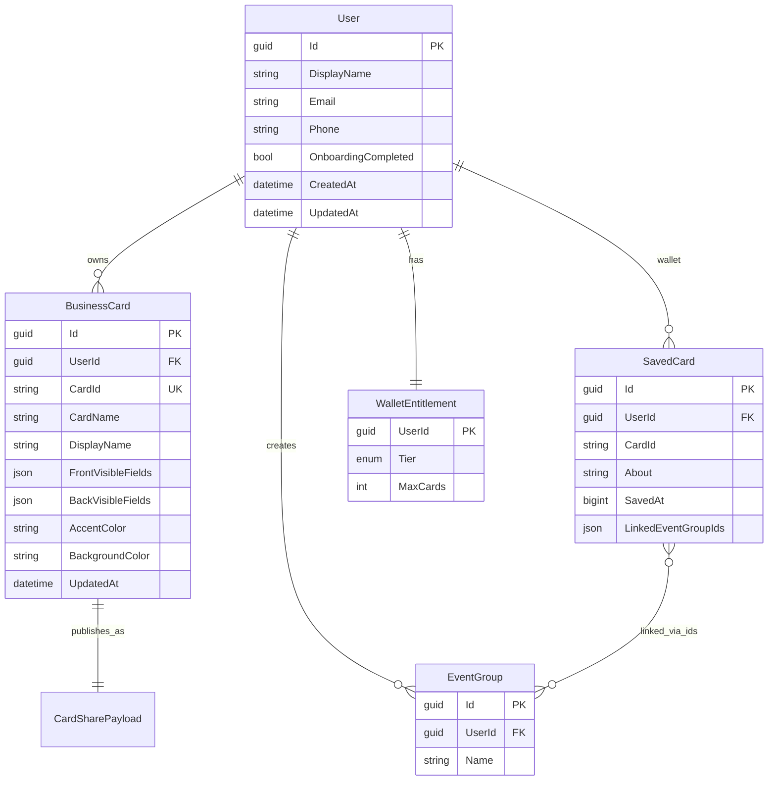

# Cardence .NET Backend API Dokümantasyonu

Bu doküman, **Cardence** Flutter uygulamasının mevcut domain modeli, iş kuralları ve veri sözleşmelerine dayanarak tasarlanacak **.NET backend** servisinin teknik spesifikasyonudur.

> **Geliştirme rehberi:** Kurulum, Cursor ile geliştirme akışı, faz planı ve prompt şablonları için bkz. **[backend-development.md](./backend-development.md)**

> **Mevcut durum (Flutter):** Uygulama tamamen **offline-first** çalışır. Tüm veriler `SharedPreferences` üzerinde JSON olarak saklanır. Firebase yalnızca `firebase_core` ile initialize edilir; `firebase_auth` ve `cloud_firestore` henüz kullanılmaz. Backend bu repository arayüzlerinin HTTP implementasyonu olarak konumlandırılmalıdır.

### Doküman seti

| Dosya                                                           | İçerik                                       |
| --------------------------------------------------------------- | -------------------------------------------- |
| [backend/docs/backend-development.md](./backend-development.md) | Nasıl geliştirilir — kurulum, Cursor, fazlar |
| **Bu dosya** (`backend/docs/dotnet-backend-api.md`)             | Ne geliştirilir — endpoint'ler, DTO'lar      |
| [backend/docs/database-design.md](./database-design.md)         | Veritabanı şeması, ilişkiler, migration      |
| `.cursor/rules/dotnet-api.mdc`                                  | Cursor Agent backend kuralları               |

---

## İçindekiler

1. [Mimari Genel Bakış](#1-mimari-genel-bakış)
2. [Önerilen .NET Proje Yapısı](#2-önerilen-net-proje-yapısı)
3. [Domain Modeli ve İlişkiler](#3-domain-modeli-ve-ilişkiler)
4. [Kimlik Doğrulama (Auth)](#4-kimlik-doğrulama-auth)
5. [API Konvansiyonları](#5-api-konvansiyonları)
6. [Endpoint Referansı](#6-endpoint-referansı)
7. [DTO ve JSON Sözleşmeleri](#7-dto-ve-json-sözleşmeleri)
8. [İş Kuralları](#8-iş-kuralları)
9. [Doğrulama Kuralları](#9-doğrulama-kuralları)
10. [Hata Kodları](#10-hata-kodları)
11. [Veritabanı Şeması](#11-veritabanı-şeması)
12. [Flutter Entegrasyon Planı](#12-flutter-entegrasyon-planı)
13. [Uygulama Aşamaları (Roadmap)](#13-uygulama-aşamaları-roadmap)

---

## 1. Mimari Genel Bakış

### 1.1 Sistem bağlamı

```
┌─────────────────┐     HTTPS/JWT      ┌──────────────────────────┐
│  Flutter App    │ ◄────────────────► │  Cardence .NET API       │
│  (Clean Arch)   │                    │  ASP.NET Core 8+         │
│                 │                    │  EF Core + PostgreSQL    │
│  Domain         │                    │  Clean Architecture      │
│  Repository ◄───┼── HTTP Impl        │  Domain / App / Infra    │
└─────────────────┘                    └──────────────────────────┘
         │                                        │
         │ SharedPreferences (geçiş dönemi)     │ OAuth providers
         ▼                                        ▼
   Offline cache                          Google / Apple / Phone / LinkedIn
```

### 1.2 Flutter feature → Backend modül eşlemesi

| Flutter Feature  | Domain Entity         | Backend Modül   | Backend'de mi?      |
| ---------------- | --------------------- | --------------- | ------------------- |
| `onboarding`     | `OnboardingCardDraft` | `BusinessCards` | Evet                |
| `my_cards`       | (onboarding entity)   | `BusinessCards` | Evet                |
| `profile`        | (onboarding entity)   | `BusinessCards` | Evet                |
| `saved_cards`    | `SavedCard`           | `Wallet`        | Evet                |
| `saved_cards`    | `WalletPlanTier`      | `Subscriptions` | Evet                |
| `event_groups`   | `EventGroup`          | `EventGroups`   | Evet                |
| `settings`       | `ThemePreference`     | —               | Hayır (cihaz-local) |
| `shell` / `home` | —                     | —               | Hayır               |

### 1.3 Temel kavramlar

| Kavram               | Açıklama                                                          |
| -------------------- | ----------------------------------------------------------------- |
| **BusinessCard**     | Kullanıcının **kendi** dijital kartviziti (`OnboardingCardDraft`) |
| **SavedCard**        | Başka birinden alınan ve **cüzdana** kaydedilen kart kopyası      |
| **CardSharePayload** | QR / paylaşım için kompakt JSON sözleşmesi                        |
| **EventGroup**       | Etkinlik / networking grubu; yalnızca SavedCard'lara bağlanır     |
| **WalletQuota**      | Kayıtlı kart limiti (Free: 15, Premium: 200)                      |

**Kritik ayrım:** `BusinessCard.cardId` global olarak paylaşılabilir (QR). `SavedCard.cardId` aynı public ID'yi referans alır ancak kullanıcıya özel cüzdan kaydıdır (not, `savedAt`, grup bağlantıları).

---

## 2. Önerilen .NET Proje Yapısı

```
Cardence.Api/
├── Cardence.Api/                    # ASP.NET Core Web API, controllers, middleware
├── Cardence.Application/            # Use cases, DTOs, validators, interfaces
├── Cardence.Domain/                 # Entities, enums, domain rules
├── Cardence.Infrastructure/         # EF Core, repositories, auth, external services
└── Cardence.Tests/                  # Unit + integration tests
```

### Katman sorumlulukları

| Katman             | İçerik                                                                 |
| ------------------ | ---------------------------------------------------------------------- |
| **Domain**         | `User`, `BusinessCard`, `SavedCard`, `EventGroup`, `WalletEntitlement` |
| **Application**    | CQRS handlers, FluentValidation, mapping (AutoMapper/Mapster)          |
| **Infrastructure** | `DbContext`, JWT, OAuth token doğrulama, Stripe/App Store webhook      |
| **Api**            | REST controllers, Swagger, global exception handler, rate limiting     |

### Önerilen NuGet paketleri

- `Microsoft.AspNetCore.Authentication.JwtBearer`
- `Microsoft.EntityFrameworkCore` + `Npgsql.EntityFrameworkCore.PostgreSQL`
- `FluentValidation.AspNetCore`
- `Swashbuckle.AspNetCore`
- `Serilog.AspNetCore`
- `Microsoft.AspNetCore.RateLimiting`

---

## 3. Domain Modeli ve İlişkiler

### 3.1 ER diyagramı



### 3.2 İlişki kuralları

1. **BusinessCard** bir kullanıcıya aittir; `cardId` global unique (QR paylaşımı).
2. **SavedCard** kullanıcı cüzdanına aittir; aynı `cardId` kullanıcı başına yalnızca bir kez eklenebilir.
3. **EventGroup** yalnızca **SavedCard** kayıtlarına bağlanır; BusinessCard asla bağlanmaz.
4. EventGroup silindiğinde tüm SavedCard'lardan ilgili `linkedEventGroupIds` temizlenir.
5. `ThemePreference` backend'e taşınmaz; cihazda kalır.

---

## 4. Kimlik Doğrulama (Auth)

Flutter `AuthConstants` şu sağlayıcıları tanımlar:

| Sağlayıcı | Firebase `providerId` | Backend stratejisi                |
| --------- | --------------------- | --------------------------------- |
| Google    | `google.com`          | ID token doğrula → JWT üret       |
| Apple     | `apple.com`           | Identity token doğrula → JWT üret |
| Telefon   | `phone`               | Firebase/OTP doğrula → JWT üret   |
| LinkedIn  | `linkedin.com`        | OAuth code exchange → JWT üret    |

### 4.1 Önerilen akış

```
Client                          Backend
  │                                │
  │── POST /auth/{provider} ──────►│ Provider token doğrula
  │◄── { accessToken, refreshToken, user } ──│
  │                                │
  │── GET /api/v1/cards ──────────►│ JWT Bearer doğrula
  │◄── 200 + data ─────────────────│
```

### 4.2 JWT payload (öneri)

```json
{
  "sub": "user-guid",
  "email": "user@example.com",
  "tier": "free",
  "exp": 1710000000
}
```

### 4.3 User DTO

```json
{
  "id": "3fa85f64-5717-4562-b3fc-2c963f66afa6",
  "displayName": "Furkan Çağlar",
  "email": "furkan@example.com",
  "phone": "+905551234567",
  "authProviders": ["google.com"],
  "onboardingCompleted": true,
  "walletTier": "free",
  "createdAt": "2026-06-05T08:00:00Z"
}
```

---

## 5. API Konvansiyonları

### 5.1 Endpoint isimlendirme (PascalCase)

Swagger'da gruplar (`Authentication`, `BusinessCards`…) altında **düz, okunabilir PascalCase** path'ler kullanılır:

| Kural                                                           | Örnek                                          |
| --------------------------------------------------------------- | ---------------------------------------------- |
| Her segment PascalCase                                          | `/LoginWithGoogle`, `/SaveBusinessCard`        |
| Kebab-case / snake_case **yok**                                 | ~~`/api/v1/business-cards`~~                   |
| `/api/v1` prefix **yok**                                        | `/BusinessCards`                               |
| HTTP metodu + anlamlı isim                                      | `POST /SaveBusinessCard`, `GET /BusinessCards` |
| Swagger tag = domain grubu                                      | `Authentication`, `BusinessCards`, `Wallet`    |
| Path'te `{id}` / `{cardId}` **yok** — kimlik query veya body'de | `GET /BusinessCard?cardId=...`                 |

**Örnek Swagger grupları:**

```
Authentication
  POST /Authentication
  POST /LoginWithPhone
  POST /LoginWithEmail
  POST /SendOTP
  POST /RefreshAuthentication

BusinessCards
  GET  /BusinessCards
  GET  /BusinessCard?cardId=...
  POST /SaveBusinessCard
```

### 5.2 Genel kurallar

| Kural         | Değer                                       |
| ------------- | ------------------------------------------- |
| Base URL      | `https://cardenceapi.app`                   |
| Auth          | `Authorization: Bearer {accessToken}`       |
| Content-Type  | `application/json`                          |
| Tarih formatı | ISO 8601 UTC (`2026-06-05T08:00:00Z`)       |
| `savedAt`     | Unix epoch **milliseconds** (Flutter uyumu) |
| Renkler       | Hex `#RRGGBB`                               |
| ID formatı    | UUID v4 (`cardId` dahil)                    |
| Sayfalama     | `?page=1&pageSize=20` (ileride)             |

### Standart response zarfı

```json
{
  "success": true,
  "data": {},
  "error": null,
  "traceId": "abc-123"
}
```

Hata durumunda:

```json
{
  "success": false,
  "data": null,
  "error": {
    "code": "WALLET_LIMIT_REACHED",
    "message": "Kayıtlı kart limitine ulaştınız.",
    "details": {
      "tier": "free",
      "usedCount": 15,
      "maxCards": 15
    }
  },
  "traceId": "abc-123"
}
```

---

## 6. Endpoint Referansı

### 6.1 Authentication (Swagger tag)

Authentication endpoint'leri **genel `ApiResponse` zarfından farklı** bir yanıt formatı kullanır (`AuthServiceResponse`):

```json
{
  "error": {
    "Code": 0,
    "Description": "string",
    "Message": "string"
  },
  "success": true,
  "message": "string",
  "entity": {}
}
```

Başarılı oturum yanıtlarında `entity` alanı `AuthSessionEntity` döner:

```json
{
  "accessToken": "eyJ...",
  "refreshToken": "refresh-...",
  "userId": "uuid",
  "expiresIn": 3600,
  "email": "user@example.com",
  "phone": null,
  "displayName": null
}
```

`LoginWithPhone` ve `LoginWithEmail` iki modda çalışır: `otpCode` gönderilmezse OTP gönderir (`entity: null`); `otpCode` ile çağrılırsa doğrular ve oturum açar.

| Method | Endpoint                 | Açıklama                                          | Auth  |
| ------ | ------------------------ | ------------------------------------------------- | ----- |
| `POST` | `/Authentication`        | E-posta ile oturum aç (kullanıcı yoksa oluşturur) | Hayır |
| `POST` | `/LoginWithPhone`        | OTP gönder veya `otpCode` ile doğrula + oturum aç | Hayır |
| `POST` | `/LoginWithEmail`        | OTP gönder veya `otpCode` ile doğrula + oturum aç | Hayır |
| `POST` | `/SendOTP`               | Telefona OTP gönder                               | Hayır |
| `POST` | `/RefreshAuthentication` | Refresh token ile yeni access token               | Hayır |

**Planlanan (henüz implemente değil):** `/LoginWithGoogle`, `/LoginWithApple`, `/LoginWithLinkedIn`, `/Me`, `/UpdateProfile`, `/DeleteAccount`

**POST `/Authentication` request:**

```json
{
  "userId": "string",
  "email": "string",
  "password": "string",
  "udId": "string",
  "apiKey": "string",
  "alreadyTryOtherMethod": true
}
```

**POST `/LoginWithPhone` request (OTP gönder):**

```json
{
  "phone": "+905551234567",
  "udId": "optional-device-id"
}
```

**POST `/LoginWithPhone` request (OTP doğrula + oturum aç):**

```json
{
  "phone": "+905551234567",
  "otpCode": "123456",
  "udId": "optional-device-id"
}
```

**POST `/LoginWithEmail` request:** `phone` yerine `email` alanı kullanılır; `otpCode` opsiyoneldir.

**POST `/SendOTP` request:**

```json
{
  "phone": "+905551234567",
  "udId": "optional-device-id"
}
```

**POST `/RefreshAuthentication` request:**

```json
{
  "refreshToken": "refresh-token"
}
```

**Geliştirme notu:** OTP kodları şu an in-memory saklanır ve log'a yazılır; production'da SMS/e-posta sağlayıcısı entegre edilmelidir.

---

### 6.2 BusinessCards (Swagger tag)

Flutter: `OnboardingRepository`, `SaveOnboardingDraftCard`, `GetOnboardingDraftCards`

| Method   | Endpoint                      | Flutter Use Case                                     | Auth         |
| -------- | ----------------------------- | ---------------------------------------------------- | ------------ |
| `GET`    | `/BusinessCards`              | `GetOnboardingDraftCards`                            | Evet         |
| `GET`    | `/BusinessCard?cardId=`       | `GetOnboardingDraftCard`                             | Evet         |
| `POST`   | `/SaveBusinessCard`           | Yeni kart oluştur                                    | Evet         |
| `PUT`    | `/UpdateBusinessCard`         | `SaveOnboardingDraftCard` (upsert; `cardId` body'de) | Evet         |
| `DELETE` | `/DeleteBusinessCard?cardId=` | _(henüz Flutter'da yok)_                             | Evet         |
| `GET`    | `/BusinessCardShare?cardId=`  | QR için `CardSharePayload`                           | Evet (sahip) |

**PUT `/UpdateBusinessCard` — BusinessCardDto (request/response; `cardId` zorunlu):**

```json
{
  "cardName": "İş Kartım",
  "displayName": "Furkan Çağlar",
  "email": "furkan@example.com",
  "phone": "+905551234567",
  "company": "Cardence",
  "title": "Mobile Developer",
  "website": "https://cardence.app",
  "linkedin": "https://linkedin.com/in/furkan",
  "skills": "Flutter, .NET, UI/UX",
  "school": "İTÜ",
  "about": "Dijital kartvizit tutkunu.",
  "frontVisibleFields": ["company", "title", "email"],
  "backVisibleFields": ["phone", "linkedin", "website"],
  "accentColor": "#1B365D",
  "backgroundColor": "#FFFFFF",
  "lastUsedPaletteBackgroundColor": "#F4F5F7",
  "cardId": "a1b2c3d4-e5f6-7890-abcd-ef1234567890"
}
```

> **Not:** `linkedEventGroupIds` istekte gelse bile backend **her zaman boş** kabul eder (`SaveOnboardingDraftCard` kuralı).

---

### 6.3 PublicCards (Swagger tag)

Kimlik doğrulama gerektirmez; yalnızca paylaşıma açık alanlar döner.

| Method | Endpoint                           | Açıklama                 | Auth  |
| ------ | ---------------------------------- | ------------------------ | ----- |
| `GET`  | `/PublicBusinessCardShare?cardId=` | `CardSharePayload` döner | Hayır |
| `HEAD` | `/PublicBusinessCard?cardId=`      | Kart var mı (204/404)    | Hayır |

**GET response — CardSharePayload (kısa anahtarlar):**

```json
{
  "id": "a1b2c3d4-e5f6-7890-abcd-ef1234567890",
  "n": "Furkan Çağlar",
  "e": "furkan@example.com",
  "p": "+905551234567",
  "c": "Cardence",
  "t": "Mobile Developer",
  "w": "https://cardence.app",
  "l": "https://linkedin.com/in/furkan",
  "s": "Flutter, .NET",
  "o": "İTÜ",
  "h": "Dijital kartvizit tutkunu."
}
```

Boş alanlar JSON'dan **çıkarılır** (QR boyutu optimizasyonu).

---

### 6.4 Wallet (Swagger tag)

Flutter: `SavedCardRepository`, `AddSavedCard`, `GetSavedCards`, `GetSavedCardsWalletQuota`

| Method   | Endpoint                   | Flutter Use Case                                      | Auth |
| -------- | -------------------------- | ----------------------------------------------------- | ---- |
| `GET`    | `/SavedCards`              | `GetSavedCards`                                       | Evet |
| `POST`   | `/SaveSavedCard`           | `AddSavedCard`                                        | Evet |
| `PUT`    | `/UpdateSavedCard`         | `SaveSavedCard` (not/grup güncelle; `cardId` body'de) | Evet |
| `DELETE` | `/DeleteSavedCard?cardId=` | _(henüz Flutter'da yok)_                              | Evet |
| `GET`    | `/WalletQuota`             | `GetSavedCardsWalletQuota`                            | Evet |

**POST `/SaveSavedCard` — üç giriş modu:**

1. **Tam kart:**

```json
{
  "cardId": "external-card-id",
  "displayName": "Ayşe Yılmaz",
  "email": "ayse@example.com",
  "company": "Acme",
  "title": "Designer"
}
```

2. **Yalnızca ID (stub):**

```json
{
  "cardId": "a1b2c3d4-e5f6-7890-abcd-ef1234567890"
}
```

Backend public card'dan profil alanlarını hydrate edebilir.

3. **CardSharePayload:**

```json
{
  "id": "a1b2c3d4-e5f6-7890-abcd-ef1234567890",
  "n": "Ayşe Yılmaz",
  "e": "ayse@example.com"
}
```

**POST response durumları (`AddSavedCardResult` eşlemesi):**

| Durum            | HTTP              | `error.code`            |
| ---------------- | ----------------- | ----------------------- |
| Başarılı         | `201 Created`     | —                       |
| Duplicate        | `409 Conflict`    | `WALLET_DUPLICATE_CARD` |
| Limit aşıldı     | `403 Forbidden`   | `WALLET_LIMIT_REACHED`  |
| Geçersiz payload | `400 Bad Request` | `INVALID_CARD_PAYLOAD`  |

**GET `/WalletQuota` response:**

```json
{
  "tier": "free",
  "usedCount": 8,
  "maxCards": 15,
  "remaining": 7,
  "canAddMore": true,
  "isNearLimit": false,
  "usageFraction": 0.533
}
```

---

### 6.5 EventGroups (Swagger tag)

Flutter: `EventGroupRepository`, `GetEventGroups`, `SaveEventGroups`

| Method   | Endpoint                            | Açıklama                              | Auth |
| -------- | ----------------------------------- | ------------------------------------- | ---- |
| `GET`    | `/EventGroups`                      | Tüm gruplar (+ opsiyonel `cardCount`) | Evet |
| `POST`   | `/SaveEventGroup`                   | Yeni grup oluştur                     | Evet |
| `PUT`    | `/UpdateEventGroup`                 | Grup adı güncelle (`id` body'de)      | Evet |
| `DELETE` | `/DeleteEventGroup?id=`             | Grup sil + SavedCard'lardan unlink    | Evet |
| `POST`   | `/LinkEventGroupCards`              | Kartları gruba bağla (`id` body'de)   | Evet |
| `DELETE` | `/UnlinkEventGroupCard?id=&cardId=` | Tek kartı gruptan çıkar               | Evet |
| `GET`    | `/EventGroupCards?id=`              | Gruptaki kayıtlı kartlar              | Evet |

**POST `/SaveEventGroup` request:**

```json
{
  "name": "Web Summit 2026"
}
```

**Response:**

```json
{
  "id": "group-uuid",
  "name": "Web Summit 2026",
  "cardCount": 0,
  "createdAt": "2026-06-05T08:00:00Z"
}
```

> Flutter şu an tüm listeyi `saveEventGroups` ile toplu yazar. Backend **granüler REST** tercih eder; istemci tek tek CRUD yapmalıdır.

---

### 6.6 Subscriptions (Swagger tag)

Flutter: `WalletEntitlementRepository`, `UpgradeWalletPlan`

| Method | Endpoint             | Açıklama                         | Auth           |
| ------ | -------------------- | -------------------------------- | -------------- |
| `GET`  | `/WalletEntitlement` | Mevcut plan                      | Evet           |
| `POST` | `/UpgradeWalletPlan` | Premium'a yükselt (ödeme başlat) | Evet           |
| `POST` | `/AppStoreWebhook`   | App Store Server Notification    | Webhook secret |
| `POST` | `/PlayStoreWebhook`  | Google Play RTDN                 | Webhook secret |

**Plan limitleri:**

| Tier      | `maxCards` |
| --------- | ---------- |
| `free`    | 15         |
| `premium` | 200        |

---

### 6.7 Onboarding (Swagger tag)

| Method | Endpoint              | Açıklama                     | Auth |
| ------ | --------------------- | ---------------------------- | ---- |
| `GET`  | `/OnboardingStatus`   | `onboardingCompleted` durumu | Evet |
| `POST` | `/CompleteOnboarding` | `CompleteOnboarding`         | Evet |

---

## 7. DTO ve JSON Sözleşmeleri

### 7.1 BusinessCardDto ↔ `OnboardingCardDraftModel`

| Alan                             | Tip        | Zorunlu            | Açıklama                        |
| -------------------------------- | ---------- | ------------------ | ------------------------------- |
| `cardId`                         | `string`   | Hayır\*            | UUID; yoksa server üretir       |
| `cardName`                       | `string?`  | Düzenlemede evet   | Liste başlığı                   |
| `displayName`                    | `string?`  | Onboarding'de evet | Ad soyad                        |
| `email`                          | `string?`  | Onboarding'de evet |                                 |
| `phone`                          | `string?`  | Hayır              | E.164 önerilir                  |
| `company`                        | `string?`  | Onboarding'de evet |                                 |
| `title`                          | `string?`  | Onboarding'de evet | Pozisyon                        |
| `website`                        | `string?`  | Hayır              |                                 |
| `linkedin`                       | `string?`  | Hayır              |                                 |
| `skills`                         | `string?`  | Hayır              | Virgülle ayrılmış               |
| `school`                         | `string?`  | Hayır              |                                 |
| `about`                          | `string?`  | Hayır              | Max ~200-500 karakter           |
| `frontVisibleFields`             | `string[]` | Hayır              | Max 3, `frontFieldKeys` içinden |
| `backVisibleFields`              | `string[]` | Hayır              | Max 3, `backFieldKeys` içinden  |
| `accentColor`                    | `string?`  | Hayır              | `#RRGGBB`                       |
| `backgroundColor`                | `string?`  | Hayır              | `#RRGGBB`                       |
| `lastUsedPaletteBackgroundColor` | `string?`  | Hayır              | Son özel renk                   |
| `linkedEventGroupIds`            | `string[]` | **Yok sayılır**    | Her zaman `[]`                  |

**Geçerli `frontFieldKeys`:** `title`, `email`, `phone`, `company`, `skills`, `school`, `about`

**Geçerli `backFieldKeys`:** `email`, `phone`, `website`, `linkedin`

**Varsayılan ön yüz:** `["company", "title", "email"]`

### 7.2 SavedCardDto ↔ `SavedCardModel`

| Alan                  | Tip        | Zorunlu | Açıklama                          |
| --------------------- | ---------- | ------- | --------------------------------- |
| `cardId`              | `string`   | Evet    | Min 8 karakter, `[a-zA-Z0-9\-_]+` |
| `displayName`         | `string?`  | Hayır   |                                   |
| `email`               | `string?`  | Hayır   |                                   |
| `phone`               | `string?`  | Hayır   |                                   |
| `company`             | `string?`  | Hayır   |                                   |
| `title`               | `string?`  | Hayır   |                                   |
| `website`             | `string?`  | Hayır   |                                   |
| `linkedin`            | `string?`  | Hayır   |                                   |
| `skills`              | `string?`  | Hayır   |                                   |
| `school`              | `string?`  | Hayır   |                                   |
| `about`               | `string?`  | Hayır   | Kullanıcı notu                    |
| `savedAt`             | `long?`    | Hayır   | Unix ms; server set eder          |
| `linkedEventGroupIds` | `string[]` | Hayır   | EventGroup UUID listesi           |

### 7.3 CardSharePayload — QR sözleşmesi

| Kısa anahtar | Tam alan      | Tip                    |
| ------------ | ------------- | ---------------------- |
| `id`         | `cardId`      | `string` **(zorunlu)** |
| `n`          | `displayName` | `string?`              |
| `e`          | `email`       | `string?`              |
| `p`          | `phone`       | `string?`              |
| `c`          | `company`     | `string?`              |
| `t`          | `title`       | `string?`              |
| `w`          | `website`     | `string?`              |
| `l`          | `linkedin`    | `string?`              |
| `s`          | `skills`      | `string?`              |
| `o`          | `school`      | `string?`              |
| `h`          | `about`       | `string?`              |

### 7.4 EventGroupDto

```json
{
  "id": "uuid",
  "name": "Web Summit 2026"
}
```

---

## 8. İş Kuralları

### 8.1 BusinessCard (Kendi kart)

| #   | Kural                                                                  | Kaynak                    |
| --- | ---------------------------------------------------------------------- | ------------------------- |
| 1   | `cardId` yoksa UUID v4 üret                                            | `OnboardingDraftHelper`   |
| 2   | `linkedEventGroupIds` kayıtta her zaman temizlenir                     | `SaveOnboardingDraftCard` |
| 3   | `frontVisibleFields` max 3, `backVisibleFields` max 3                  | `AppConstants`            |
| 4   | Onboarding tamamlamak için: displayName, company, title, email zorunlu | `OnboardingValidation`    |
| 5   | `cardName` düzenleme ekranında zorunlu                                 | `MyCardEditPage`          |
| 6   | `cardId` global unique (QR paylaşımı)                                  | Domain                    |

### 8.2 SavedCard (Cüzdan)

| #   | Kural                                                        | Kaynak                     |
| --- | ------------------------------------------------------------ | -------------------------- |
| 1   | Aynı `cardId` kullanıcı cüzdanında tekrar eklenemez          | `AddSavedCard`             |
| 2   | Free plan: max 15 kart; Premium: max 200                     | `SavedCardsWalletLimits`   |
| 3   | Limit dolunca ekleme reddedilir                              | `AddSavedCardLimitReached` |
| 4   | `savedAt` eklenirken `DateTime.now().millisecondsSinceEpoch` | `AddSavedCard`             |
| 5   | Yalnızca `cardId` ile stub kayıt mümkün                      | `CardSharePayload`         |
| 6   | `dummy-*` ID'ler demo veridir; persist edilmez               | `SavedCardsCatalog`        |
| 7   | %85 dolulukta `isNearLimit = true` uyarısı                   | `SavedCardsWalletQuota`    |

### 8.3 EventGroup

| #   | Kural                                                | Kaynak                    |
| --- | ---------------------------------------------------- | ------------------------- |
| 1   | Grup adı boş olamaz                                  | UI validation             |
| 2   | Aynı kullanıcıda case-insensitive duplicate ad yasak | UI validation             |
| 3   | Grup silinince tüm SavedCard'lardan ID kaldırılır    | Presentation cascade      |
| 4   | BusinessCard'lara grup bağlantısı yok                | `SaveOnboardingDraftCard` |

### 8.4 Paylaşım / QR

| #   | Kural                                                                                                |
| --- | ---------------------------------------------------------------------------------------------------- |
| 1   | QR JSON = `CardSharePayload.toJson()`                                                                |
| 2   | Boş alanlar JSON'a dahil edilmez                                                                     |
| 3   | Gelecekte QR yalnızca `cardId` veya URL içerebilir; client `GET /public/cards/{id}` ile hydrate eder |

---

## 9. Doğrulama Kuralları

Backend **FluentValidation** ile Flutter `AppValidators` ve `OnboardingValidation` kurallarını yansıtmalıdır.

### 9.1 Regex kuralları

```csharp
// personName — ad / soyad (min 2 karakter)
^[a-zA-ZğüşöçıİĞÜŞÖÇ][a-zA-ZğüşöçıİĞÜŞÖÇ'\-\.]{1,}$

// organizationText — şirket / pozisyon
^[a-zA-ZğüşöçıİĞÜŞÖÇ0-9][a-zA-ZğüşöçıİĞÜŞÖÇ0-9\s&\.,'\-]{1,}$

// email
^[a-zA-Z0-9._%+-]+@[a-zA-Z0-9.-]+\.[a-zA-Z]{2,}$

// skillToken — yetenek etiketi
^[a-zA-ZğüşöçıİĞÜŞÖÇ0-9][a-zA-ZğüşöçıİĞÜŞÖÇ0-9+#./\-\s]{1,}$

// cardId (manuel giriş)
^[a-zA-Z0-9\-_]{8,}$
```

### 9.2 Onboarding zorunlu alanlar

- `displayName`: ad + soyad ayrı ayrı `personName` geçmeli
- `company`: `organizationText`, boş olamaz
- `title`: `organizationText`, boş olamaz
- `email`: `email` regex, boş olamaz

### 9.3 Diğer limitler

| Alan                     | Limit                                     |
| ------------------------ | ----------------------------------------- |
| `about` (BusinessCard)   | ~200 karakter (UI)                        |
| `about` (SavedCard notu) | 240-500 karakter (ekrana göre)            |
| `skills`                 | Virgülle ayrılmış; her token `skillToken` |
| `frontVisibleFields`     | Max 3                                     |
| `backVisibleFields`      | Max 3                                     |
| Hex renk                 | `^#[0-9A-Fa-f]{6}$`                       |

---

## 10. Hata Kodları

| HTTP | `error.code`                 | Açıklama                          |
| ---- | ---------------------------- | --------------------------------- |
| 400  | `VALIDATION_ERROR`           | FluentValidation hatası           |
| 400  | `INVALID_CARD_PAYLOAD`       | Geçersiz kart ID veya payload     |
| 401  | `UNAUTHORIZED`               | Token eksik/geçersiz              |
| 403  | `WALLET_LIMIT_REACHED`       | Cüzdan kotası doldu               |
| 403  | `FORBIDDEN`                  | Kaynağa erişim yok                |
| 404  | `CARD_NOT_FOUND`             | BusinessCard veya public card yok |
| 404  | `EVENT_GROUP_NOT_FOUND`      | Grup bulunamadı                   |
| 409  | `WALLET_DUPLICATE_CARD`      | Kart zaten cüzdanda               |
| 409  | `DUPLICATE_EVENT_GROUP_NAME` | Aynı isimde grup var              |
| 422  | `ONBOARDING_INCOMPLETE`      | Zorunlu alanlar eksik             |
| 429  | `RATE_LIMIT_EXCEEDED`        | Rate limit                        |
| 500  | `INTERNAL_ERROR`             | Beklenmeyen hata                  |

---

## 11. Veritabanı Şeması

> **Detaylı DB dokümantasyonu:** Tablo açıklamaları, ER diyagramı, auth ilişkisi, migration planı ve Flutter eşlemesi için bkz. **[database-design.md](./database-design.md)**

### 11.1 PostgreSQL tabloları (özet)

```sql
CREATE TABLE users (
    id              UUID PRIMARY KEY DEFAULT gen_random_uuid(),
    display_name    VARCHAR(200),
    email           VARCHAR(320) UNIQUE,
    phone           VARCHAR(20),
    onboarding_completed BOOLEAN NOT NULL DEFAULT FALSE,
    created_at      TIMESTAMPTZ NOT NULL DEFAULT NOW(),
    updated_at      TIMESTAMPTZ NOT NULL DEFAULT NOW()
);

CREATE TABLE user_auth_providers (
    user_id         UUID NOT NULL REFERENCES users(id) ON DELETE CASCADE,
    provider_id     VARCHAR(50) NOT NULL,  -- google.com, apple.com, phone, linkedin.com
    provider_user_id VARCHAR(200) NOT NULL,
    PRIMARY KEY (provider_id, provider_user_id)
);

CREATE TABLE business_cards (
    id              UUID PRIMARY KEY DEFAULT gen_random_uuid(),
    user_id         UUID NOT NULL REFERENCES users(id) ON DELETE CASCADE,
    card_id         VARCHAR(36) NOT NULL UNIQUE,  -- public QR id
    card_name       VARCHAR(200),
    display_name    VARCHAR(200),
    email           VARCHAR(320),
    phone           VARCHAR(20),
    company         VARCHAR(200),
    title           VARCHAR(200),
    website         VARCHAR(500),
    linkedin        VARCHAR(500),
    skills          TEXT,
    school          VARCHAR(200),
    about           TEXT,
    front_visible_fields JSONB NOT NULL DEFAULT '[]',
    back_visible_fields  JSONB NOT NULL DEFAULT '[]',
    accent_color    VARCHAR(7),
    background_color VARCHAR(7),
    last_used_palette_background_color VARCHAR(7),
    created_at      TIMESTAMPTZ NOT NULL DEFAULT NOW(),
    updated_at      TIMESTAMPTZ NOT NULL DEFAULT NOW()
);

CREATE TABLE wallet_entitlements (
    user_id         UUID PRIMARY KEY REFERENCES users(id) ON DELETE CASCADE,
    tier            VARCHAR(20) NOT NULL DEFAULT 'free',  -- free | premium
    max_cards       INT NOT NULL DEFAULT 15,
    updated_at      TIMESTAMPTZ NOT NULL DEFAULT NOW()
);

CREATE TABLE saved_cards (
    id              UUID PRIMARY KEY DEFAULT gen_random_uuid(),
    user_id         UUID NOT NULL REFERENCES users(id) ON DELETE CASCADE,
    card_id         VARCHAR(36) NOT NULL,  -- public reference
    display_name    VARCHAR(200),
    email           VARCHAR(320),
    phone           VARCHAR(20),
    company         VARCHAR(200),
    title           VARCHAR(200),
    website         VARCHAR(500),
    linkedin        VARCHAR(500),
    skills          TEXT,
    school          VARCHAR(200),
    about           TEXT,  -- kullanıcı notu
    saved_at        BIGINT NOT NULL,
    sort_order      INT NOT NULL DEFAULT 0,
    UNIQUE (user_id, card_id)
);

CREATE TABLE event_groups (
    id              UUID PRIMARY KEY DEFAULT gen_random_uuid(),
    user_id         UUID NOT NULL REFERENCES users(id) ON DELETE CASCADE,
    name            VARCHAR(200) NOT NULL,
    created_at      TIMESTAMPTZ NOT NULL DEFAULT NOW(),
    UNIQUE (user_id, LOWER(name))
);

CREATE TABLE saved_card_event_groups (
    saved_card_id   UUID NOT NULL REFERENCES saved_cards(id) ON DELETE CASCADE,
    event_group_id  UUID NOT NULL REFERENCES event_groups(id) ON DELETE CASCADE,
    PRIMARY KEY (saved_card_id, event_group_id)
);
```

### 11.2 Normalizasyon notu

Flutter `linkedEventGroupIds`'i SavedCard üzerinde JSON array olarak tutar. Backend'de `saved_card_event_groups` join tablosu önerilir; API response'ta Flutter uyumu için array olarak serialize edilir.

---

## 12. Flutter Entegrasyon Planı

### 12.1 Repository değişimi (Clean Architecture)

Mevcut local repository'lerin HTTP karşılıkları eklenir; domain arayüzleri **değişmez**:

| Interface                     | Mevcut Impl                        | Yeni Impl                    |
| ----------------------------- | ---------------------------------- | ---------------------------- |
| `OnboardingRepository`        | `OnboardingRepositoryImpl` (local) | `OnboardingRemoteRepository` |
| `SavedCardRepository`         | `SavedCardRepositoryImpl` (local)  | `SavedCardRemoteRepository`  |
| `EventGroupRepository`        | `EventGroupRepositoryImpl` (local) | `EventGroupRemoteRepository` |
| `WalletEntitlementRepository` | local                              | `WalletRemoteRepository`     |

### 12.2 Önerilen Data katmanı dosyaları

```
lib/features/onboarding/data/
  datasources/onboarding_remote_datasource.dart
  repositories/onboarding_repository_impl.dart  # remote + local cache

lib/features/saved_cards/data/
  datasources/saved_card_remote_datasource.dart

lib/core/network/
  api_client.dart          # Dio / http
  auth_interceptor.dart    # JWT refresh
  api_exception.dart
```

### 12.3 Offline-first strateji (opsiyonel)

1. Remote'dan çek → local cache'e yaz
2. Yazma işlemleri → remote + optimistic local update
3. Auth yokken mevcut SharedPreferences davranışı korunur (geçiş dönemi)

### 12.4 CardSharePayload → Backend geçişi

**Şimdi:** QR içinde tam JSON gömülü.

**Backend ile:**

1. QR yalnızca `https://cardence.app/c/{cardId}` veya `{"id":"..."}` içerir
2. Client `GET /PublicBusinessCardShare?cardId=` çağırır
3. `AddSavedCard` public endpoint'ten hydrate eder

---

## 13. Uygulama Aşamaları (Roadmap)

### Faz 1 — Temel (MVP)

- [ ] .NET solution scaffold (Clean Architecture)
- [ ] PostgreSQL + EF Core migrations
- [ ] JWT auth (Google + Apple)
- [ ] `BusinessCard` CRUD
- [x] `GET /PublicBusinessCardShare?cardId=` (QR çözümleme)
- [ ] Swagger + health check

### Faz 2 — Cüzdan

- [ ] `SavedCard` CRUD + kota kontrolü
- [ ] `AddSavedCard` iş kuralları (duplicate, limit)
- [ ] `GET /wallet/quota`
- [ ] Flutter `SavedCardRemoteDataSource`

### Faz 3 — Etkinlik Grupları

- [ ] EventGroup CRUD
- [ ] SavedCard ↔ EventGroup linking
- [ ] Grup silme cascade

### Faz 4 — Abonelik

- [ ] App Store / Play Store webhook
- [ ] Premium tier (`maxCards: 200`)
- [ ] `UpgradeWalletPlan` gerçek ödeme entegrasyonu

### Faz 5 — Gelişmiş

- [ ] Phone + LinkedIn auth
- [ ] Kart silme endpoint'leri
- [ ] `sortOrder` (sürükle-bırak sıralama)
- [ ] Rate limiting + audit log
- [ ] OpenAPI client codegen (Flutter)

---

## Ek: Flutter Repository Arayüzleri (Referans)

```dart
// OnboardingRepository
Future<bool> isOnboardingCompleted();
Future<void> setOnboardingCompleted();
Future<void> saveDraftCard(OnboardingCardDraft draft);
Future<OnboardingCardDraft?> getDraftCard();
Future<List<OnboardingCardDraft>> getDraftCards();

// SavedCardRepository
Future<List<SavedCard>> getSavedCards();
Future<void> saveCard(SavedCard card);

// EventGroupRepository
Future<List<EventGroup>> getEventGroups();
Future<void> saveEventGroups(List<EventGroup> groups);

// WalletEntitlementRepository
Future<WalletPlanTier> getPlanTier();
Future<void> setPlanTier(WalletPlanTier tier);
```

---

## Ek: App Sabitleri

| Sabit                | Değer           |
| -------------------- | --------------- |
| `appName`            | Cardence        |
| `appTagline`         | Share & Connect |
| `maxFrontCardFields` | 3               |
| `maxBackCardFields`  | 3               |
| `freeMaxCards`       | 15              |
| `premiumMaxCards`    | 200             |
| `nearLimitThreshold` | %85             |

---

_Bu doküman Cardence Flutter codebase'inin mevcut durumuna göre hazırlanmıştır. Domain entity'ler, model JSON alanları ve use case iş kuralları doğrudan `lib/features/**/domain` ve `lib/features/**/data` katmanlarından türetilmiştir._
