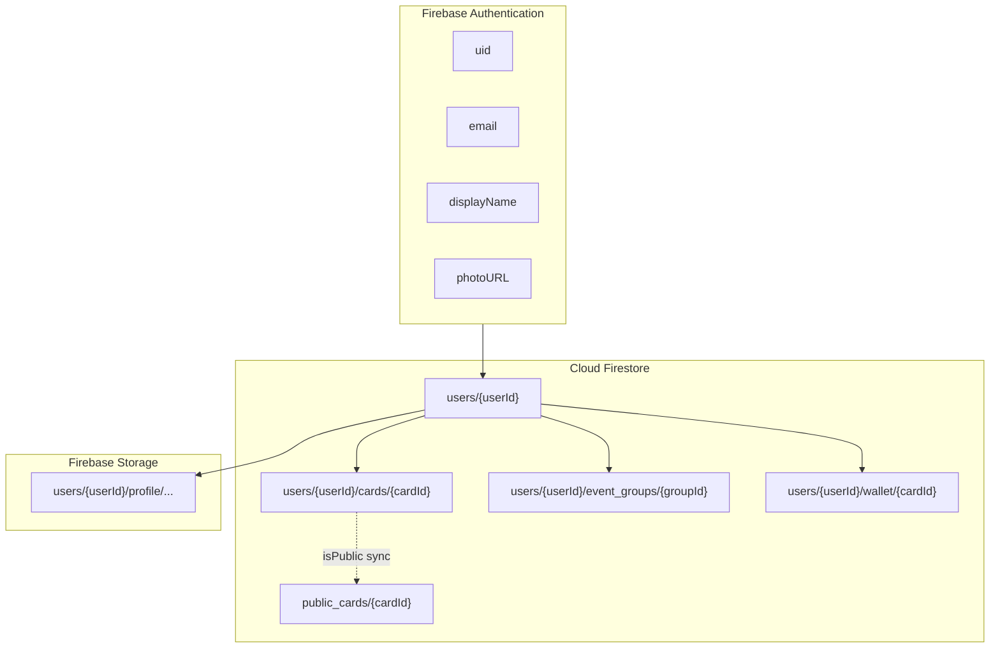
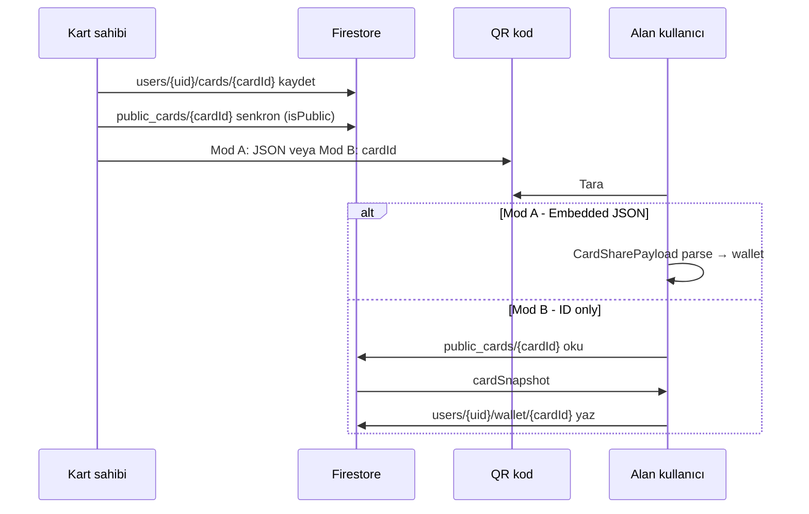

# Cardence – Firestore Kullanıcı Veri Modeli

Bu doküman, Cardence dijital kartvizit uygulamasında bir kullanıcıya ait verilerin **Firebase Authentication**, **Cloud Firestore** ve **Firebase Storage** üzerinde **hangi yapıda**, **neden** ve **nasıl** tutulacağını tanımlar.

**Hedef kitle:** Backend / Firebase entegrasyonu geliştirenler, Clean Architecture data katmanını yazacak ekip.

**İlgili dokümanlar:**

| Doküman | Konu |
|---------|------|
| [ARCHITECTURE.md](ARCHITECTURE.md) | Clean Architecture, katmanlar |
| [QR_CARD_WALLET_FLOW.md](QR_CARD_WALLET_FLOW.md) | QR paylaşım ve cüzdan akışı |
| [LOGIN_METHODS.md](LOGIN_METHODS.md) | Google, Apple, Telefon, LinkedIn giriş |

**Kod referansları (domain entity’ler):**

| Entity | Dosya |
|--------|-------|
| `OnboardingCardDraft` | `lib/features/onboarding/domain/entities/onboarding_card_draft.dart` |
| `SavedCard` | `lib/features/saved_cards/domain/entities/saved_card.dart` |
| `CardSharePayload` | `lib/features/saved_cards/domain/entities/card_share_payload.dart` |
| `EventGroup` | `lib/features/event_groups/domain/entities/event_group.dart` |

**Durum (2026):** Uygulama veriyi şu an **SharedPreferences** ile cihazda tutar. Bu doküman, buluta taşınacak **hedef şema**dır.

---

## İçindekiler

1. [Genel bakış](#1-genel-bakış)
2. [Firebase Authentication](#2-firebase-authentication)
3. [Firestore koleksiyon haritası](#3-firestore-koleksiyon-haritası)
4. [users/{userId} – Hesap profili](#4-usersuserid--hesap-profili)
5. [users/{userId}/cards/{cardId} – Kendi kartları](#5-usersuseridcardscardid--kendi-kartları)
6. [users/{userId}/event_groups/{groupId} – Etkinlik grupları](#6-usersuseridevent_groupsgroupid--etkinlik-grupları)
7. [users/{userId}/wallet/{cardId} – Cüzdan (kaydedilen kartlar)](#7-usersuseridwalletcardid--cüzdan-kaydedilen-kartlar)
8. [public_cards/{cardId} – QR / herkese açık kart](#8-public_cardscardid--qr--herkese-açık-kart)
9. [Firebase Storage](#9-firebase-storage)
10. [Yerel model ↔ Firestore eşlemesi](#10-yerel-model--firestore-eşlemesi)
11. [QR paylaşım ile Firestore ilişkisi](#11-qr-paylaşım-ile-firestore-ilişkisi)
12. [Senkronizasyon stratejisi](#12-senkronizasyon-stratejisi)
13. [Güvenlik kuralları](#13-güvenlik-kuralları)
14. [Firestore indeksleri](#14-firestore-indeksleri)
15. [Veri akışı özeti](#15-veri-akışı-özeti)
16. [Eski şemadan farklar](#16-eski-şemadan-farklar)
17. [Uygulama checklist’i](#17-uygulama-checklisti)

---

## 1. Genel bakış

Cardence üç tür veri taşır:

| Tür | Örnek | Nerede |
|-----|-------|--------|
| **Kimlik** | uid, email, giriş sağlayıcısı | Firebase Auth |
| **Kullanıcıya özel uygulama verisi** | Profil, kendi kartları, cüzdan, etkinlik grupları | Firestore (kullanıcı alt koleksiyonları) |
| **Paylaşıma açık kart kopyası** | QR ile okunan canlı kart | Firestore `public_cards` |
| **Dosyalar** | Profil fotoğrafı | Firebase Storage |

### Tasarım ilkeleri

1. **Kullanıcı verisi kullanıcı path’i altında** — `users/{userId}/...` alt koleksiyonları; güvenlik kuralları basitleşir.
2. **Çoklu kart** — Bir kullanıcının birden fazla dijital kartı olabilir (profil carousel, “İş kartım”, “Freelance” vb.).
3. **Cüzdan snapshot** — Kaydedilen kart, paylaşım anındaki içeriği saklar; kaynak kart silinse bile cüzdan çalışır.
4. **Kişisel not ayrımı** — Cüzdandaki `personalNotes`, kart sahibinin `about` alanından ayrı tutulur.
5. **Domain uyumu** — Firestore alan adları mümkün olduğunca mevcut Dart entity’leriyle birebir eşleşir.

### Servis dağılımı



---

## 2. Firebase Authentication

Authentication **yalnızca kimlik** tutar. Kart içeriği, tasarım ve cüzdan burada **olmaz**.

| Alan | Tip | Açıklama |
|------|-----|----------|
| `uid` | string | Benzersiz kullanıcı kimliği; Firestore path’lerinde `userId` |
| `email` | string? | E-posta (telefon girişinde null olabilir) |
| `displayName` | string? | OAuth veya kayıt sırasında gelen ad |
| `photoURL` | string? | OAuth profil fotoğrafı URL’i |
| `phoneNumber` | string? | Telefon ile giriş |
| `emailVerified` | bool | E-posta doğrulama durumu |
| `providerData` | array | `google.com`, `apple.com`, `phone`, `password`, `linkedin.com` |

**Desteklenen giriş yöntemleri:** Google, Apple, Telefon, LinkedIn — ayrıntı: [LOGIN_METHODS.md](LOGIN_METHODS.md).

**Firestore ile ilişki:** İlk girişte Cloud Function veya istemci tarafında `users/{uid}` dökümanı oluşturulur. Auth alanları (`email`, `displayName`, `photoURL`) isteğe bağlı olarak Firestore’a kopyalanır; uygulama profili tek kaynak Firestore olabilir.

---

## 3. Firestore koleksiyon haritası

```
firestore-root/
├── users/
│   └── {userId}                          # Hesap profili
│       ├── cards/
│       │   └── {cardId}                  # Kullanıcının kendi dijital kartları
│       ├── event_groups/
│       │   └── {groupId}                 # Etkinlik / networking grupları
│       └── wallet/
│           └── {cardId}                  # Başkalarından kaydedilen kartlar
└── public_cards/
    └── {cardId}                          # QR / ID ile herkese açık kart kopyası
```

| Path | Döküman sayısı (kullanıcı başına) | Sahiplik |
|------|-----------------------------------|----------|
| `users/{userId}` | 1 | Kullanıcı |
| `users/{userId}/cards/{cardId}` | 0…N (tipik 1–5) | Kullanıcı |
| `users/{userId}/event_groups/{groupId}` | 0…N | Kullanıcı |
| `users/{userId}/wallet/{cardId}` | 0…N | Kullanıcı |
| `public_cards/{cardId}` | 0…N (paylaşılan kartlar) | Kart sahibi yazar; herkes okur |

---

## 4. `users/{userId}` – Hesap profili

**Amaç:** Authentication’ı tamamlayan uygulama profili, tercihler ve meta bilgiler.

**Döküman ID:** Firebase Auth `uid` ile aynı.

### Alan tanımları

| Alan | Tip | Zorunlu | Açıklama |
|------|-----|---------|----------|
| `id` | string | Evet | `userId`; döküman ID ile aynı |
| `email` | string | Hayır* | Giriş e-postası (*telefon girişinde boş olabilir) |
| `phone` | string | Hayır | Telefon giriş numarası |
| `displayName` | string | Hayır | Uygulama profil adı |
| `photoUrl` | string | Hayır | Storage veya OAuth URL |
| `authProviders` | array\<string\> | Hayır | `["google.com", "apple.com"]` |
| `onboardingCompleted` | boolean | Evet | İlk kurulum tamamlandı mı |
| `defaultCardId` | string | Hayır | Profil carousel varsayılan kartı |
| `locale` | string | Hayır | `tr`, `en` — ileride i18n |
| `createdAt` | timestamp | Evet | Hesap oluşturulma |
| `updatedAt` | timestamp | Evet | Son profil güncellemesi |
| `lastLoginAt` | timestamp | Hayır | Son giriş (analitik / sync) |

### Örnek döküman

```json
{
  "id": "k7x9m2pQ1aBcDeFgHiJk",
  "email": "furkan@ornek.com",
  "displayName": "Furkan Çağlar",
  "photoUrl": "https://firebasestorage.googleapis.com/v0/b/cardence.appspot.com/o/users%2Fk7x9...%2Fprofile%2Favatar.jpg?alt=media",
  "authProviders": ["google.com"],
  "onboardingCompleted": true,
  "defaultCardId": "a1b2c3d4-e5f6-7890-abcd-ef1234567890",
  "locale": "tr",
  "createdAt": "2026-03-01T10:00:00.000Z",
  "updatedAt": "2026-06-02T14:30:00.000Z",
  "lastLoginAt": "2026-06-02T14:30:00.000Z"
}
```

### Burada tutulmaması gerekenler

- Kart içeriği → `users/{userId}/cards/`
- Cüzdan → `users/{userId}/wallet/`
- Etkinlik grupları → `users/{userId}/event_groups/`

---

## 5. `users/{userId}/cards/{cardId}` – Kendi kartları

**Amaç:** Kullanıcının oluşturduğu ve düzenlediği dijital kartvizitler. Uygulamadaki `OnboardingCardDraft` entity’sinin bulut karşılığıdır.

**Döküman ID:** Kartın `cardId` değeri (UUID). QR paylaşımda kullanılan id ile **aynı** olmalıdır.

### 5.1 Meta alanları

| Alan | Tip | Zorunlu | Açıklama |
|------|-----|---------|----------|
| `cardId` | string | Evet | Benzersiz kart kimliği |
| `userId` | string | Evet | Sahip uid (path ile tutarlı) |
| `cardName` | string | Hayır | Liste başlığı: “İş kartım”, “Konferans 2026” |
| `isPrimary` | boolean | Hayır | Varsayılan / birincil kart |
| `isPublic` | boolean | Evet | `public_cards` ile senkron mu |
| `createdAt` | timestamp | Evet | Oluşturulma |
| `updatedAt` | timestamp | Evet | Son düzenleme |
| `publicUpdatedAt` | timestamp | Hayır | Son public kopya senkronu |

### 5.2 İletişim ve içerik alanları

Uygulamada `OnboardingCardDraft.availableFields` ile tanımlı alanlar:

| Alan | Tip | Entity karşılığı | Açıklama |
|------|-----|------------------|----------|
| `displayName` | string | `displayName` | Ad soyad |
| `email` | string | `email` | E-posta |
| `phone` | string | `phone` | Telefon |
| `company` | string | `company` | Şirket |
| `title` | string | `title` | Ünvan |
| `website` | string | `website` | Web sitesi |
| `linkedin` | string | `linkedin` | LinkedIn URL |
| `skills` | string | `skills` | Yetenekler (serbest metin) |
| `school` | string | `school` | Okul |
| `about` | string | `about` | Hakkımda |

> **Not:** Kendi kartında arka yüz “Notlar” özelliği yoktur; `about` ön/arka yüz alan seçimine göre kart üzerinde gösterilir. Kaydedilen kartlardaki kişisel not (`personalNotes`) ile karıştırılmamalıdır.

### 5.3 Görünüm ve düzen

| Alan | Tip | Zorunlu | Açıklama |
|------|-----|---------|----------|
| `frontVisibleFields` | array\<string\> | Evet | Ön yüzde gösterilecek alan anahtarları (en fazla 3) |
| `backVisibleFields` | array\<string\> | Evet | Arka yüz alanları (en fazla 3) |
| `accentColor` | string | Hayır | Metin rengi, hex: `#1B365D` |
| `backgroundColor` | string | Hayır | Kart arka plan rengi, hex |
| `lastUsedPaletteBackgroundColor` | string | Hayır | Son seçilen palet rengi |

**Geçiş alanı (opsiyonel, migration):**

| Alan | Tip | Açıklama |
|------|-----|----------|
| `visibleFields` | array\<string\> | Eski birleşik liste; yeni kayıtlarda yazılmaz |

**Ön yüz varsayılan alanlar** (`OnboardingCardDraft.defaultFrontVisibleFields`):

```json
["title", "email", "phone"]
```

**Seçilebilir alan anahtarları:**

| Yüz | Anahtarlar |
|-----|------------|
| Ön (`frontFieldKeys`) | `title`, `email`, `phone`, `company`, `skills`, `school`, `about` |
| Arka (`backFieldKeys`) | `email`, `phone`, `website`, `linkedin` |

### 5.4 Etkinlik grubu bağlantısı

| Alan | Tip | Açıklama |
|------|-----|----------|
| `linkedEventGroupIds` | array\<string\> | Bu kartın bağlı olduğu `event_groups` id’leri |

### 5.5 Arama (ileride)

| Alan | Tip | Açıklama |
|------|-----|----------|
| `searchKeywords` | array\<string\> | `company`, `title`, `skills` birleşiminden üretilen küçük harf anahtar kelimeler |

### Örnek döküman

```json
{
  "cardId": "a1b2c3d4-e5f6-7890-abcd-ef1234567890",
  "userId": "k7x9m2pQ1aBcDeFgHiJk",
  "cardName": "İş kartım",
  "isPrimary": true,
  "isPublic": true,
  "displayName": "Furkan Çağlar",
  "email": "furkan@ornek.com",
  "phone": "+90 532 000 00 00",
  "company": "Cardence",
  "title": "Product Engineer",
  "website": "https://cardence.app",
  "linkedin": "https://linkedin.com/in/furkancaglar",
  "skills": "Flutter, Firebase, UX",
  "school": null,
  "about": null,
  "frontVisibleFields": ["title", "email", "phone"],
  "backVisibleFields": ["website", "linkedin"],
  "accentColor": "#FFFFFF",
  "backgroundColor": "#1B365D",
  "lastUsedPaletteBackgroundColor": "#1B365D",
  "linkedEventGroupIds": ["evt-uuid-1", "evt-uuid-2"],
  "searchKeywords": ["cardence", "product engineer", "flutter"],
  "createdAt": "2026-03-15T09:00:00.000Z",
  "updatedAt": "2026-06-02T12:00:00.000Z",
  "publicUpdatedAt": "2026-06-02T12:00:00.000Z"
}
```

### Erişim

| İşlem | Kural |
|-------|-------|
| Okuma | Sadece `request.auth.uid == userId` |
| Oluşturma | Auth’lı kullanıcı; `userId == request.auth.uid` |
| Güncelleme / silme | Sadece kart sahibi |

---

## 6. `users/{userId}/event_groups/{groupId}` – Etkinlik grupları

**Amaç:** Konferans, networking etkinliği vb. gruplar; kartlar `linkedEventGroupIds` ile bu gruplara bağlanır.

**Entity:** `EventGroup` — `id`, `name`.

| Alan | Tip | Zorunlu | Açıklama |
|------|-----|---------|----------|
| `id` | string | Evet | Grup UUID |
| `name` | string | Evet | Grup adı: “Web Summit 2026” |
| `createdAt` | timestamp | Evet | Oluşturulma |
| `updatedAt` | timestamp | Evet | Son güncelleme |

### Örnek döküman

```json
{
  "id": "evt-uuid-1",
  "name": "Flutter Meetup İstanbul",
  "createdAt": "2026-05-10T18:00:00.000Z",
  "updatedAt": "2026-05-10T18:00:00.000Z"
}
```

### Erişim

Tüm CRUD: sadece `request.auth.uid == userId`.

---

## 7. `users/{userId}/wallet/{cardId}` – Cüzdan (kaydedilen kartlar)

**Amaç:** QR veya kart ID ile alınan başka kullanıcıların kartları. Uygulamadaki `SavedCard` entity’sinin genişletilmiş bulut karşılığıdır.

**Döküman ID:** Kaynak kartın `cardId` değeri.

### 7.1 Cüzdan meta alanları

| Alan | Tip | Zorunlu | Açıklama |
|------|-----|---------|----------|
| `cardId` | string | Evet | Kaynak kart kimliği |
| `userId` | string | Evet | Cüzdan sahibi (path ile aynı) |
| `sourceUserId` | string | Hayır | Kart sahibinin uid’si (biliniyorsa) |
| `savedAt` | timestamp | Evet | Kaydedilme zamanı |
| `priority` | number | Hayır | Önem derecesi / sıralama (README planı) |
| `personalNotes` | string | Hayır | Kullanıcının arka yüzde tuttuğu **özel not** |
| `updatedAt` | timestamp | Evet | Son düzenleme (not güncellemesi vb.) |

### 7.2 `cardSnapshot` – Paylaşım anındaki kart verisi

Kaynak kart silinse veya değişse bile cüzdan listesi bu snapshot ile çalışır. QR’daki `CardSharePayload` ile aynı anlam alanları taşır (uzun anahtar adlarıyla).

| Alan | Tip | QR kısa anahtar | Açıklama |
|------|-----|-----------------|----------|
| `displayName` | string | `n` | Ad soyad |
| `email` | string | `e` | E-posta |
| `phone` | string | `p` | Telefon |
| `company` | string | `c` | Şirket |
| `title` | string | `t` | Ünvan |
| `website` | string | `w` | Web sitesi |
| `linkedin` | string | `l` | LinkedIn |
| `skills` | string | `s` | Yetenekler |
| `school` | string | `o` | Okul |
| `about` | string | `h` | Hakkımda (kart sahibinin) |

**Tasarım alanları (opsiyonel, görüntüleme için):**

| Alan | Tip | Açıklama |
|------|-----|----------|
| `accentColor` | string | Snapshot anındaki metin rengi |
| `backgroundColor` | string | Snapshot anındaki arka plan |
| `frontVisibleFields` | array\<string\> | Ön yüz düzeni |
| `backVisibleFields` | array\<string\> | Arka yüz düzeni |

### `personalNotes` vs `cardSnapshot.about`

| Alan | Kimin verisi | Nerede gösterilir |
|------|--------------|-------------------|
| `cardSnapshot.about` | Kart sahibinin paylaştığı “Hakkımda” | Kartın arka yüzü (paylaşılan içerik) |
| `personalNotes` | Cüzdan sahibinin kendi notu | Kaydedilen kart detayında “Notlar” |

Uygulamada `SavedCard.about` şu an kişisel not olarak kullanılıyor; Firestore’a taşınırken **`personalNotes`** adına ayrılması önerilir.

### Örnek döküman

```json
{
  "cardId": "b2c3d4e5-f6a7-8901-bcde-f23456789012",
  "userId": "k7x9m2pQ1aBcDeFgHiJk",
  "sourceUserId": "x9y8z7w6v5u4t3s2r1q0p9o8n7m6",
  "savedAt": "2026-06-01T16:45:00.000Z",
  "priority": 2,
  "personalNotes": "Web Summit'te tanıştık. Flutter ekibine yönlendir.",
  "updatedAt": "2026-06-02T09:00:00.000Z",
  "cardSnapshot": {
    "displayName": "Ayşe Yılmaz",
    "email": "ayse@startup.io",
    "phone": "+90 555 111 22 33",
    "company": "Startup.io",
    "title": "CEO",
    "website": "https://startup.io",
    "linkedin": "https://linkedin.com/in/ayseyilmaz",
    "skills": "SaaS, Growth",
    "school": null,
    "about": "B2B SaaS founder",
    "accentColor": "#FFFFFF",
    "backgroundColor": "#1B365D",
    "frontVisibleFields": ["title", "email", "phone"],
    "backVisibleFields": ["website", "linkedin"]
  }
}
```

### Erişim

Tüm CRUD: sadece `request.auth.uid == userId`.

---

## 8. `public_cards/{cardId}` – QR / herkese açık kart

**Amaç:** QR kod yalnızca `cardId` taşıdığında veya kart sahibi güncellediğinde alıcının **canlı** veri çekmesi. Bkz. [QR_CARD_WALLET_FLOW.md §8](QR_CARD_WALLET_FLOW.md).

**Döküman ID:** `cardId` (kaynak kart ile aynı).

| Alan | Tip | Zorunlu | Açıklama |
|------|-----|---------|----------|
| `cardId` | string | Evet | Kart kimliği |
| `ownerUserId` | string | Evet | Kart sahibi uid |
| `cardSnapshot` | map | Evet | Paylaşıma açık alanlar (§7.2 ile aynı yapı) |
| `frontVisibleFields` | array\<string\> | Evet | Ön yüz düzeni |
| `backVisibleFields` | array\<string\> | Hayır | Arka yüz düzeni |
| `accentColor` | string | Hayır | Metin rengi |
| `backgroundColor` | string | Hayır | Arka plan rengi |
| `updatedAt` | timestamp | Evet | Son yayın |

### Senkron tetikleyicileri

1. Kullanıcı kartı düzenler ve `isPublic == true` ise → `public_cards/{cardId}` güncellenir.
2. Kullanıcı kartı siler veya `isPublic = false` yapar → `public_cards/{cardId}` silinir.
3. Cloud Function alternatifi: `users/{uid}/cards/{cardId}` onWrite → public kopya yönetimi.

### Erişim

| İşlem | Kural |
|-------|-------|
| Okuma | Herkese açık veya rate-limit’li public read |
| Yazma | `request.auth.uid == ownerUserId` |

---

## 9. Firebase Storage

### Path yapısı

```
users/{userId}/profile/avatar.jpg          # Profil fotoğrafı
users/{userId}/profile/avatar_thumb.jpg      # Küçük önizleme (opsiyonel)
users/{userId}/cards/{cardId}/logo.png       # İleride kart logosu (opsiyonel)
```

### Kurallar

| Path | Okuma | Yazma |
|------|-------|-------|
| `users/{userId}/profile/*` | Auth’lı kullanıcı (kendi) veya public read (avatar) | Sadece `request.auth.uid == userId` |
| `users/{userId}/cards/{cardId}/*` | Kart sahibi | Sadece kart sahibi |

**URL kullanımı:** Yüklenen dosyanın download URL’i `users/{userId}.photoUrl` alanına yazılır. İsteğe bağlı olarak Firebase Auth `photoURL` de güncellenir.

---

## 10. Yerel model ↔ Firestore eşlemesi

### OnboardingCardDraft → `users/{userId}/cards/{cardId}`

| Dart (`OnboardingCardDraft`) | Firestore alanı |
|------------------------------|-----------------|
| `cardId` | Döküman ID + `cardId` |
| `cardName` | `cardName` |
| `displayName` … `about` | Aynı isim |
| `frontVisibleFields` | `frontVisibleFields` |
| `backVisibleFields` | `backVisibleFields` |
| `visibleFields` | `visibleFields` (legacy, opsiyonel) |
| `accentColor` | `accentColor` |
| `backgroundColor` | `backgroundColor` |
| `lastUsedPaletteBackgroundColor` | `lastUsedPaletteBackgroundColor` |
| `linkedEventGroupIds` | `linkedEventGroupIds` |
| — | `userId`, `createdAt`, `updatedAt`, `isPublic` (yeni) |

### SavedCard → `users/{userId}/wallet/{cardId}`

| Dart (`SavedCard`) | Firestore |
|--------------------|-----------|
| `cardId` | Döküman ID + `cardId` |
| `displayName` … `about` | `cardSnapshot.*` |
| `about` (cüzdan notu) | `personalNotes` (**yeniden adlandırma**) |
| `savedAt` (ms epoch) | `savedAt` (timestamp) |

### EventGroup → `users/{userId}/event_groups/{groupId}`

Birebir: `id`, `name` + `createdAt`, `updatedAt`.

### CardSharePayload ↔ cardSnapshot / QR

| Firestore `cardSnapshot` | QR JSON | CardSharePayload |
|--------------------------|---------|------------------|
| `displayName` | `n` | `n` |
| `email` | `e` | `e` |
| `phone` | `p` | `p` |
| `company` | `c` | `c` |
| `title` | `t` | `t` |
| `website` | `w` | `w` |
| `linkedin` | `l` | `l` |
| `skills` | `s` | `s` |
| `school` | `o` | `o` |
| `about` | `h` | `h` |
| — | `id` | `id` (cardId) |

**Data katmanı önerisi:** `CardSnapshotModel` tek model; `CardSharePayloadModel` ve Firestore map dönüşümü buradan türetilir.

---

## 11. QR paylaşım ile Firestore ilişkisi

Cardence’te iki paylaşım modu bir arada desteklenebilir:

| Mod | QR içeriği | Veri kaynağı | Avantaj |
|-----|------------|--------------|---------|
| **A – Embedded JSON** (mevcut) | Tam `CardSharePayload` JSON | QR’ın kendisi | Offline, sunucu gerekmez |
| **B – ID only** (Firestore) | Yalnızca `{"id":"..."}` veya deep link | `public_cards/{cardId}` | Küçük QR; kart güncellenince alıcı canlı veri çekebilir |
| **C – Hibrit** | `id` + kısa snapshot | Önce QR snapshot; arka planda Firestore fetch | Offline fallback + güncellenebilirlik |



Detaylı akış: [QR_CARD_WALLET_FLOW.md](QR_CARD_WALLET_FLOW.md).

---

## 12. Senkronizasyon stratejisi

### İlk giriş / cihaz değişimi

1. Auth başarılı → `users/{uid}` yoksa oluştur.
2. Firestore’dan `cards`, `event_groups`, `wallet` alt koleksiyonlarını çek.
3. Yerel cache (SharedPreferences veya SQLite) ile birleştir; `updatedAt` büyük olan kazanır (last-write-wins).

### Yerel → bulut (mevcut kullanıcı migration)

SharedPreferences anahtarları:

| Yerel anahtar | Firestore hedefi |
|---------------|------------------|
| Onboarding kart listesi | `users/{uid}/cards/*` |
| `event_groups` | `users/{uid}/event_groups/*` |
| `saved_cards` | `users/{uid}/wallet/*` |

Migration use case: tek seferlik upload; `cardId` yoksa UUID üret.

### Çevrimdışı davranış

- Okuma: yerel cache.
- Yazma: kuyruğa al; bağlantı gelince Firestore batch write.
- Cüzdan QR taraması: Mod A’da tamamen offline çalışır.

---

## 13. Güvenlik kuralları

Aşağıdaki kurallar `firestore.rules` için **taslak**tır; production öncesi test edilmelidir.

```javascript
rules_version = '2';
service cloud.firestore {
  match /databases/{database}/documents {

    function isSignedIn() {
      return request.auth != null;
    }

    function isOwner(userId) {
      return isSignedIn() && request.auth.uid == userId;
    }

    // --- users/{userId} ---
    match /users/{userId} {
      allow read, write: if isOwner(userId);

      match /cards/{cardId} {
        allow read, write: if isOwner(userId);
      }

      match /event_groups/{groupId} {
        allow read, write: if isOwner(userId);
      }

      match /wallet/{cardId} {
        allow read, write: if isOwner(userId);
      }
    }

    // --- public_cards/{cardId} ---
    match /public_cards/{cardId} {
      allow read: if true;
      allow create, update, delete: if isSignedIn()
        && request.resource.data.ownerUserId == request.auth.uid;
    }
  }
}
```

### Storage kuralları (taslak)

```javascript
rules_version = '2';
service firebase.storage {
  match /b/{bucket}/o {
    match /users/{userId}/{allPaths=**} {
      allow read: if request.auth != null && request.auth.uid == userId;
      allow write: if request.auth != null && request.auth.uid == userId;
    }
  }
}
```

---

## 14. Firestore indeksleri

Varsayılan single-field indeksler çoğu sorgu için yeterlidir. Aşağıdakiler **composite index** gerektirebilir:

| Koleksiyon | Sorgu | İndeks alanları |
|------------|-------|-----------------|
| `users/{uid}/cards` | Birincil kart | `isPrimary` ASC, `updatedAt` DESC |
| `users/{uid}/wallet` | Önceliğe göre liste | `priority` DESC, `savedAt` DESC |
| `users/{uid}/wallet` | Son kaydedilenler | `savedAt` DESC |
| `public_cards` | Sahibe göre (admin) | `ownerUserId` ASC, `updatedAt` DESC |

---

## 15. Veri akışı özeti

| Veri | Konum | Yazar | Okuyucu |
|------|-------|-------|---------|
| Giriş kimliği | Firebase Auth | Auth SDK | Uygulama |
| Hesap profili | `users/{userId}` | Kullanıcı | Kullanıcı |
| Kendi kartları | `users/{userId}/cards/{cardId}` | Kart sahibi | Kart sahibi |
| Etkinlik grupları | `users/{userId}/event_groups/{groupId}` | Kullanıcı | Kullanıcı |
| Cüzdan | `users/{userId}/wallet/{cardId}` | Cüzdan sahibi | Cüzdan sahibi |
| Public kart | `public_cards/{cardId}` | Kart sahibi | Herkes (QR) |
| Profil fotoğrafı | Storage `users/{userId}/profile/` | Kullanıcı | URL ile |

---

## 16. Eski şemadan farklar

Önceki `FIREBASE_USER_DATA.md` ve `PROGRESS.md` tasarımından sapmalar:

| Eski | Güncel | Neden |
|------|--------|-------|
| `business_cards/{cardId}` (root) | `users/{userId}/cards/{cardId}` | Çoklu kart + daha basit güvenlik |
| Tek kart / kullanıcı | N kart / kullanıcı | Profil carousel, `MyCardEditPage` |
| `visibleFields` (5 alan) | `frontVisibleFields` + `backVisibleFields` | Ön/arka yüz düzeni |
| `department`, `sector`, `twitter`… | Yok (şimdilik) | UI / entity’de tanımlı değil |
| `saved_cards/{userId}/cards` | `users/{userId}/wallet` | Path tutarlılığı |
| `cardData` | `cardSnapshot` | QR payload ile uyumlu isim |
| `SavedCard.about` | `personalNotes` | Kart sahibi vs cüzdan notu ayrımı |

---

## 17. Uygulama checklist’i

Firebase entegrasyonu için önerilen sıra:

- [ ] `authentication` feature: Auth repository + giriş akışları
- [ ] İlk girişte `users/{uid}` oluşturma
- [ ] `my_cards` data: Firestore datasource + `OnboardingCardDraftModel` map
- [ ] `event_groups` data: Firestore datasource
- [ ] `saved_cards` data: Firestore wallet datasource; `personalNotes` alanı
- [ ] `public_cards` sync (kart kaydet / sil / isPublic toggle)
- [ ] SharedPreferences → Firestore migration use case
- [ ] Offline cache + write queue
- [ ] `firestore.rules` ve Storage rules deploy
- [ ] QR Mod B: `FetchSharedCardById` use case ([QR_CARD_WALLET_FLOW.md §8](QR_CARD_WALLET_FLOW.md))

---

## Özet

Bir Cardence kullanıcısı için Firestore’da tutulması gerekenler:

1. **Profil** — `users/{userId}`: kimlik tamamlayıcı, tercihler, varsayılan kart.
2. **Kendi kartları** — `users/{userId}/cards/{cardId}`: iletişim, tasarım, ön/arka yüz düzeni, etkinlik bağlantıları.
3. **Etkinlik grupları** — `users/{userId}/event_groups/{groupId}`: ad + id.
4. **Cüzdan** — `users/{userId}/wallet/{cardId}`: snapshot + kişisel not + kayıt zamanı.
5. **Public kart** (opsiyonel) — `public_cards/{cardId}`: QR ile canlı paylaşım.

Kimlik Firebase Auth’ta kalır; dosyalar Storage’da tutulur ve URL’ler Firestore’da referans edilir.
