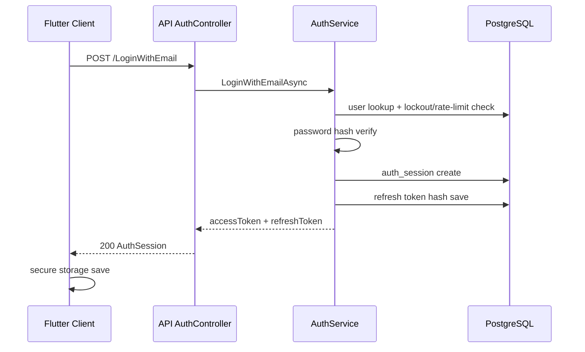
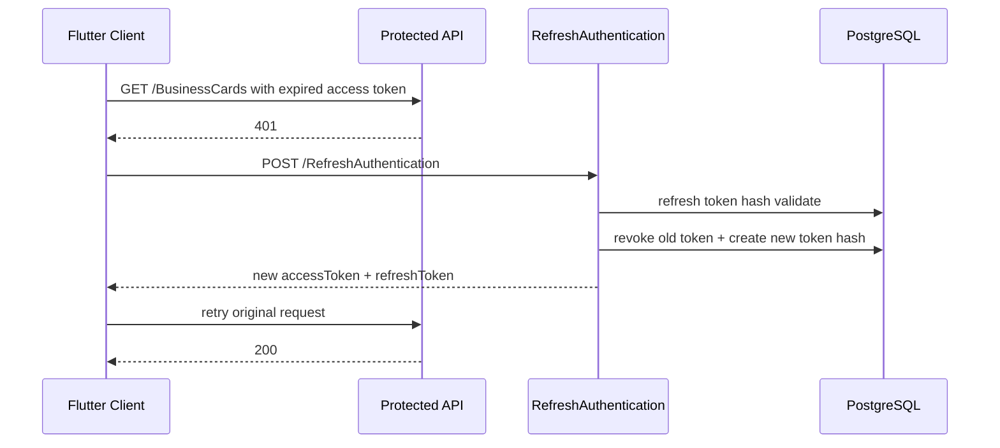
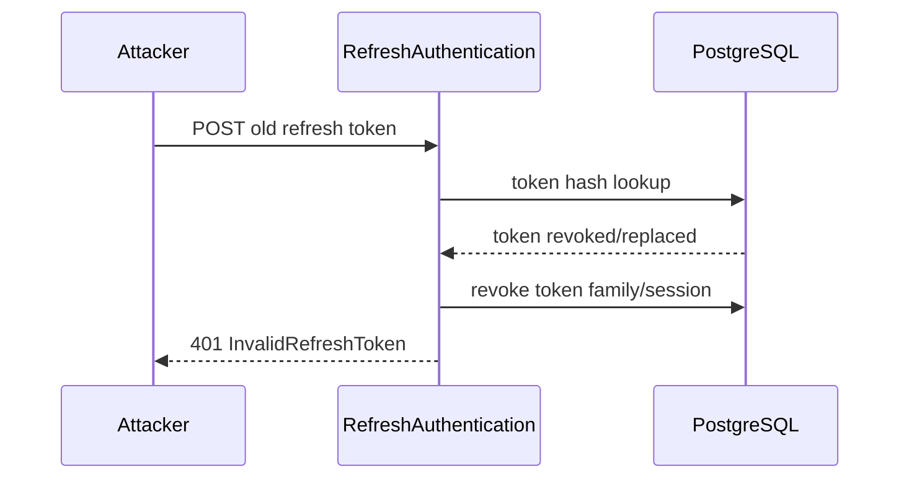

# Cardence – Login Güvenlik ve Kullanıcı Dostu Akış Planı

Bu doküman, Cardence login sistemini **backend + database + Flutter client** birlikte ele alarak daha güvenli, daha anlaşılır ve kullanıcı dostu hale getirmek için uygulanacak iş akışını tanımlar.

Amaç:

- Kullanıcının giriş deneyimini net, hızlı ve güvenli yapmak.
- Şifre, OTP, sosyal giriş ve refresh-token akışlarını tek güvenlik modeli altında toplamak.
- Brute-force, token sızıntısı, session hijacking ve hesap ele geçirme risklerini azaltmak.
- Client tarafında oturum yenileme, hata mesajları ve çıkış davranışını tutarlı hale getirmek.

---

## 1. Mevcut Durum Özeti

### Backend

Mevcut auth endpoint'leri:

- `POST /LoginWithEmail`
- `POST /LoginWithPhone`
- `POST /LoginWithLinkedIn`
- `POST /Register`
- `POST /SendOTP`
- `POST /RefreshAuthentication`
- `POST /ForgotPassword`
- `POST /ResetPassword`
- `GET /Me`

Korumalı API'ler için global JWT authorization aktiftir. Swagger arayüzü açıktır; korumalı endpoint'ler Swagger içindeki **Authorize** ile Bearer token alır.

### Database

Mevcut önemli auth tabloları:

- `users`
- `user_auth_providers`
- `auth_refresh_tokens`
- `auth_otp_tokens`
- `password_reset_tokens`

Önemli mevcut risk:

- `auth_refresh_tokens.token` ham token olarak saklanıyor.
- Refresh token rotation/reuse detection yok.
- Login denemesi, lockout, risk audit, cihaz/session kaydı için ayrı bir model yok.

### Flutter Client

Mevcut istemci tarafı:

- `DioApiClient`, Bearer token header'ı ekleyebiliyor.
- 401 olduğunda `AuthTokenCoordinator` ile refresh denemesi yapılıyor.
- Refresh başarısızsa session invalidate ediliyor.

Geliştirme alanları:

- Login ekranında güvenli ama kullanıcı dostu hata mesajları.
- Oturum süresi dolduğunda tekil ve net yönlendirme.
- Cihaz/session yönetimi.
- Biometric unlock ve secure storage iyileştirmeleri.

---

## 2. Hedef Güvenlik Prensipleri

1. **Refresh token DB'de asla ham saklanmaz.** Sadece SHA-256 hash saklanır.
2. **Refresh token tek kullanımlık döner.** Her refresh işleminde eski token revoke edilir, yeni refresh token üretilir.
3. **Token reuse tespit edilir.** Revoke edilmiş refresh token tekrar kullanılırsa ilgili session zinciri iptal edilir.
4. **Login endpoint'leri brute-force'a dayanıklı olur.** IP + kullanıcı bazlı rate-limit ve geçici lockout uygulanır.
5. **Hata mesajları enumeration'a izin vermez.** Dışarıya "e-posta yok" gibi kesin sinyal verilmez; UI kullanıcıyı doğru yola yönlendirir.
6. **Client token saklama güvenlidir.** Access token kısa ömürlü, refresh token secure storage'dadır.
7. **Kullanıcı dostu recovery akışı vardır.** Şifre sıfırlama, session expiry ve yanlış şifre mesajları anlaşılırdır.
8. **Audit trail vardır.** Login, refresh, logout, token reuse ve şüpheli aktiviteler kaydedilir.

---

## 3. Önerilen Backend Akışı

### 3.1 Login With Email / Phone

İstenen davranış:

1. Request normalize edilir.
   - Email: trim + lower-case.
   - Phone: `PhoneNormalizer`.
2. IP, user-agent ve cihaz başlığı alınır.
3. Rate-limit kontrol edilir.
4. Kullanıcı bulunur.
5. Password hash doğrulanır.
6. Başarısız deneme kayıt altına alınır.
7. Başarılıysa:
   - başarısız deneme sayacı resetlenir,
   - yeni session oluşturulur,
   - access token + refresh token döner.

Kullanıcıya gösterilecek mesaj:

- Dış API mesajı: `E-posta/telefon veya şifre hatalı.`
- UI yardımcı metni: `Şifrenizi unuttuysanız sıfırlama bağlantısı gönderebiliriz.`

Not: Register veya forgot password gibi akışlar kullanıcıyı yönlendirmek için kullanılabilir; fakat login endpoint'i kullanıcı var/yok bilgisini açık etmemelidir.

### 3.2 Refresh Authentication

Hedef akış:

1. Client refresh token gönderir.
2. Backend token hash'ini hesaplar.
3. DB'de aktif, expire olmamış ve revoke edilmemiş token aranır.
4. Token geçerli değilse:
   - eğer hash revoke edilmiş bir tokene aitse reuse şüphesi oluşur,
   - aynı session family revoke edilir,
   - 401/invalid refresh token döner.
5. Token geçerliyse:
   - eski refresh token revoke edilir,
   - yeni access token üretilir,
   - yeni refresh token üretilip hash olarak saklanır,
   - response ile yeni token çifti döner.

Bu model refresh token sızıntısı durumunda zararı azaltır.

### 3.3 Logout

Önerilen endpoint'ler:

- `POST /Logout`
- `POST /LogoutAllDevices`
- `GET /Sessions`
- `DELETE /Sessions/{sessionId}`

Davranış:

- Logout: sadece mevcut refresh token/session revoke edilir.
- Logout all devices: kullanıcının tüm aktif refresh token/session kayıtları revoke edilir.
- Sessions: cihaz adı, son kullanım zamanı, konum tahmini gibi güvenli metadata gösterilir.

### 3.4 OTP Login

OTP güvenlik kuralları:

- OTP kodu DB/Store içinde hash saklanmalı.
- Deneme sayısı sınırlı olmalı.
- Kod süresi kısa olmalı (örn. 5 dakika).
- Aynı hedefe kısa sürede tekrar OTP gönderimi engellenmeli.
- SMS/e-posta provider hatası kullanıcıya teknik detay vermemeli.

### 3.5 Password Reset

Mevcut mail-link reset akışı doğru yönde:

- token random üretiliyor,
- hash saklanıyor,
- süreli ve tek kullanımlık.

İyileştirme:

- Reset başarılı olduğunda tüm aktif refresh token'lar revoke edilmeli.
- Reset sonrası kullanıcıya "diğer cihazlardan çıkış yapıldı" bilgisi gösterilmeli.
- Reset token kullanımı audit'e yazılmalı.

---

## 4. Önerilen Database Modeli

### 4.1 `auth_refresh_tokens` iyileştirmesi

Mevcut:

- `token`
- `user_id`
- `expires_at_utc`
- `created_at_utc`

Önerilen alanlar:

```sql
token_hash text unique not null
user_id uuid not null
session_id uuid not null
family_id uuid not null
created_at_utc timestamp not null
expires_at_utc timestamp not null
revoked_at_utc timestamp null
replaced_by_token_id uuid null
created_ip text null
created_user_agent text null
last_used_at_utc timestamp null
last_used_ip text null
last_used_user_agent text null
revocation_reason text null
```

İndeksler:

```sql
unique index ix_auth_refresh_tokens_token_hash
index ix_auth_refresh_tokens_user_id
index ix_auth_refresh_tokens_session_id
index ix_auth_refresh_tokens_family_id
index ix_auth_refresh_tokens_expires_at_utc
```

### 4.2 Yeni `auth_login_attempts`

Amaç: brute-force ve abuse tespiti.

Önerilen alanlar:

```sql
id uuid primary key
normalized_identifier text not null
identifier_type text not null -- email | phone | linkedin
ip_address text null
user_agent text null
success boolean not null
failure_reason text null
created_at_utc timestamp not null
```

İndeksler:

```sql
index ix_auth_login_attempts_identifier_created_at
index ix_auth_login_attempts_ip_created_at
```

### 4.3 Yeni `auth_account_locks`

Amaç: geçici lockout.

Önerilen alanlar:

```sql
id uuid primary key
normalized_identifier text not null
identifier_type text not null
locked_until_utc timestamp not null
reason text not null
created_at_utc timestamp not null
```

### 4.4 Yeni `auth_sessions`

Amaç: cihaz bazlı session yönetimi.

Önerilen alanlar:

```sql
id uuid primary key
user_id uuid not null
device_name text null
device_platform text null
created_at_utc timestamp not null
last_seen_at_utc timestamp null
revoked_at_utc timestamp null
created_ip text null
created_user_agent text null
```

---

## 5. Client Tarafı Kullanıcı Dostu Akış

### 5.1 Login Form

UI davranışı:

- Email/telefon formatı client tarafında anında doğrulanır.
- Şifre boşsa API çağrılmaz.
- Submit sırasında buton loading olur, tekrar tıklama engellenir.
- Hatalı girişte mesaj net ama güvenlidir:
  - `E-posta/telefon veya şifre hatalı.`
  - Alt aksiyon: `Şifremi unuttum`
- Çok fazla deneme varsa:
  - `Güvenliğiniz için kısa süre bekleyin ve tekrar deneyin.`
  - Geri sayım gösterilebilir.

### 5.2 Token Saklama

Öneri:

- Access token memory + secure storage yedekli kullanılabilir.
- Refresh token sadece secure storage'da tutulmalı.
- Uygulama açılışında access token expired ise sessiz refresh denenmeli.
- Refresh başarısızsa kullanıcı tek bir session-expired dialog ile login'e yönlendirilmeli.

### 5.3 Session Expired

Davranış:

1. API 401 döner.
2. Client refresh dener.
3. Refresh başarılıysa request otomatik tekrarlanır.
4. Refresh başarısızsa:
   - token'lar silinir,
   - tek dialog gösterilir,
   - kullanıcı login sayfasına alınır.

Mevcut `DioApiClient` bu yapının temelini içeriyor; iyileştirme, refresh token rotation ve session id desteği geldikten sonra yapılmalı.

### 5.4 Biometric / Local Unlock

Opsiyonel kullanıcı dostu iyileştirme:

- Uygulama arka planda uzun süre kaldıysa local auth istenir.
- Bu backend auth yerine geçmez; sadece cihaz üzerindeki uygulama erişimini korur.
- Başarısız olursa token revoke edilmez, sadece uygulama kilit ekranına alınır.

---

## 6. Uçtan Uca İş Akışları

### 6.1 Başarılı Login



### 6.2 Expired Access Token



### 6.3 Refresh Token Reuse Detection



---

## 7. Uygulama Faz Planı

### Faz 1 – Backend Güvenlik Temeli

Backend:

- Refresh token'ı hash saklayacak şekilde değiştir.
- `auth_refresh_tokens` alanlarını genişlet.
- Refresh token rotation ekle.
- Token reuse detection ekle.
- Password reset başarılı olduğunda tüm session'ları revoke et.
- `Logout`, `LogoutAllDevices`, `Sessions` endpoint'lerini ekle.

DB:

- `auth_refresh_tokens` migration.
- `auth_sessions` migration.

Client:

- Refresh response ile dönen yeni refresh token'ı secure storage'a yaz.
- Logout endpoint entegrasyonu.

Başarı kriteri:

- Eski refresh token ikinci kez kullanıldığında 401 döner ve session kapanır.

### Faz 2 – Brute-force ve Lockout

Backend:

- `auth_login_attempts` entity/repository ekle.
- `auth_account_locks` entity/repository ekle.
- IP + identifier bazlı rate-limit uygula.
- Lockout durumunda güvenli mesaj dön.

DB:

- Login attempt ve lockout migration.

Client:

- Lockout mesajı ve opsiyonel geri sayım göster.
- Login butonunu kısa süreli disable et.

Başarı kriteri:

- Çok sayıda hatalı deneme aynı IP/identifier için geçici olarak bloklanır.

### Faz 3 – Kullanıcı Dostu Session Yönetimi

Backend:

- `GET /Sessions`
- `DELETE /Sessions/{id}`
- `POST /LogoutAllDevices`
- Session metadata güncelleme.

Client:

- Settings altında "Oturumlarım / Cihazlarım" ekranı.
- "Tüm cihazlardan çıkış yap" aksiyonu.
- Session expired dialog tekilleştirme.

Başarı kriteri:

- Kullanıcı aktif cihazlarını görebilir ve tek cihazı kapatabilir.

### Faz 4 – Risk Bazlı İyileştirme

Backend:

- Yeni cihaz / yeni lokasyon sinyali.
- Şüpheli login audit event.
- Opsiyonel e-posta bildirimi.

Client:

- Yeni cihaz uyarısı.
- Güvenlik merkezi ekranı.

Başarı kriteri:

- Riskli login denemeleri audit'te izlenebilir ve kullanıcı bilgilendirilebilir.

---

## 8. Test Planı

Backend unit/integration:

- Doğru şifre ile login başarılı.
- Yanlış şifre generic hata döner.
- Çoklu yanlış deneme lockout üretir.
- Refresh token rotation eski token'ı geçersiz kılar.
- Reused refresh token session family revoke eder.
- Logout token'ı revoke eder.
- Password reset sonrası eski refresh token çalışmaz.

Client:

- Expired access token sonrası otomatik refresh + retry.
- Refresh başarısızsa tek session expired dialog.
- Login loading sırasında ikinci submit engellenir.
- Lockout mesajı kullanıcı dostu gösterilir.
- Logout sonrası secure storage temizlenir.

Security:

- Refresh token DB'de ham görünmez.
- API loglarında access/refresh token yazılmaz.
- Login hata mesajı kullanıcı var/yok bilgisini açık etmez.
- Swagger'da korumalı endpoint'ler Bearer auth ister.

---

## 9. Önerilen Dosya/Katman Dağılımı

Backend domain:

- `backend/Cardence.Domain/Entities/AuthSession.cs`
- `backend/Cardence.Domain/Entities/AuthLoginAttempt.cs`
- `backend/Cardence.Domain/Entities/AuthAccountLock.cs`

Backend application:

- `IAuthSessionRepository`
- `IAuthLoginAttemptRepository`
- `IAuthLockoutService`
- `IRefreshTokenService`

Backend infrastructure:

- EF configurations.
- Repository implementations.
- Migration files.

Flutter:

- `lib/core/auth/auth_token_coordinator.dart`
- `lib/core/auth/session_expired_handler.dart`
- `lib/features/auth/presentation/...`
- `lib/features/settings/presentation/pages/security_sessions_page.dart`

---

## 10. MVP Uygulama Sırası

1. Refresh token hash + rotation.
2. Password reset sonrası session revoke.
3. Logout endpoint + client logout entegrasyonu.
4. Login attempt + lockout.
5. Client login UX mesajları.
6. Session/device listesi.
7. Risk/audit bildirimleri.

Bu sıra, önce en yüksek güvenlik riskini (refresh token sızıntısı ve token reuse) azaltır, sonra brute-force koruması ve kullanıcı deneyimi iyileştirmelerini ekler.
