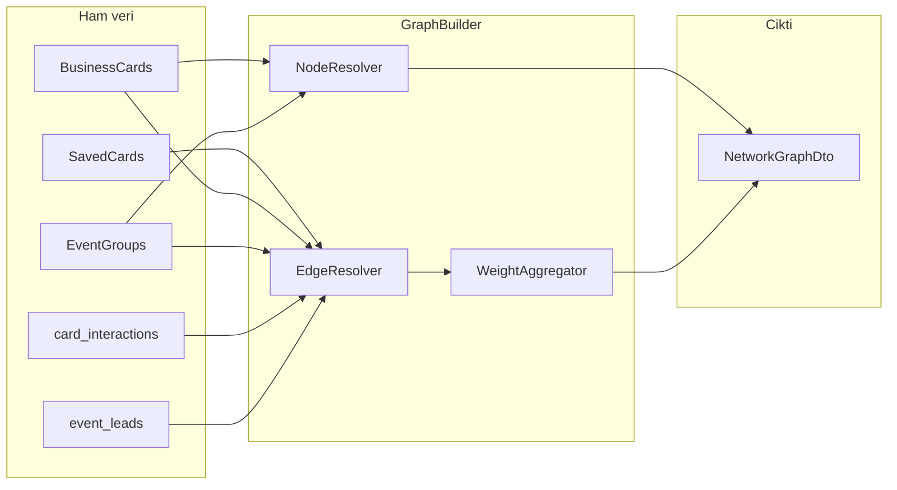
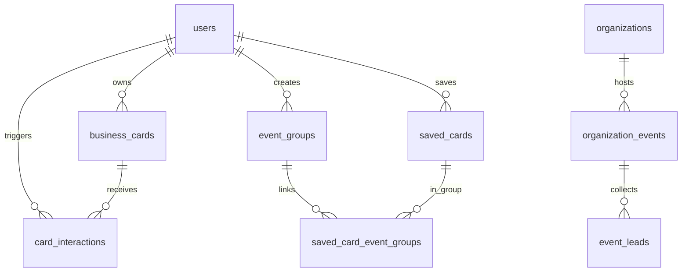

# Cardence Network Graph — Node, Edge ve Path Teorisi

Bu dokuman Cardence ag gorunumu (network graph) ozelliginin matematiksel modelini, domain karsiliklarini, veri kaynaklarini, algoritmalari ve API sozlesmesini tanimlar. Uygulama sirasinda tek referans kaynagi olarak kullanilir.

Iliskili dokumanlar:

- `docs/PRICING_TECHNICAL_ARCHITECTURE.md`
- `docs/PRICING_PHASE_DEVELOPMENT_ROADMAP.md` (Faz 3.5 stats, Faz 4.1 graph)
- `docs/PRICING_INTEGRATION_ROADMAP.md`

---

## 1. Graf Teorisi Temeli

Cardence agi, yonlu ve agirlikli bir coklu graf olarak modellenir:

```text
G = (V, E, w, σ)

V  = dugum (node) kumesi
E ⊆ V × V × T  = kenar (edge) kumesi; T kenar tipi
w: E → ℝ⁺     = kenar agirligi (varsayilan 1)
σ             = kapsam (scope): personal | event | organization
```

### 1.1 Yon ve agirlik

| Ozellik | Cardence karari | Ornek |
| --- | --- | --- |
| Yon | Cogu kenar yonlu; `works_at`, `saved` yonlu | A, B'nin kartini kaydetti → `A --saved--> B_card` |
| Cift yonlu turetim | `met_at_event` iki kisi icin simetrik gorunum uretilebilir | Ayni event group'ta iki saved card |
| Agirlik | Ayni tip tekrarlayan etkilesimde artar | 3 kez QR scan → `weight = 3` |
| Self-loop | Varsayilan kapali | Kullanici kendi kartina `owns` ile baglanir, loop sayilmaz |

### 1.2 Alt graf (subgraph)

Kullaniciya donen graph her zaman bir **alt graf**tir:

```text
G_personal(u)   = tum dugumler ve kenarlar, u'nun erisebildigi kapsamda
G_event(eg, u)  = event group eg icindeki kartlar + u ile baglantilari
G_org(o, ev)    = organization o, event ev lead havuzu ve ekip toplama kenarlari
```

---

## 2. Node (Dugum) Taksonomisi

Her node benzersiz `id`, `type`, `label` ve opsiyonel metadata tasir.

### 2.1 Node tipleri

| `type` | Domain karsiligi | `id` formati | Ornek label |
| --- | --- | --- | --- |
| `user` | Cardence kullanicisi | `user:{uuid}` | (gizlilik kapali; nadiren UI'da) |
| `card` | BusinessCard veya SavedCard temsil edilen kisi | `card:{cardId}` | Ayse Yilmaz |
| `company` | Sirket / organizasyon metni | `company:{slug}` | ABC A.S. |
| `event` | Bireysel EventGroup | `event:{uuid}` | Web Summit 2026 |
| `organization` | Business organization | `org:{uuid}` | Acme Corp |
| `org_event` | Organization event workspace | `org_event:{uuid}` | Fuar Stand 4 |
| `skill` | Ortak yetenek kumesi (opsiyonel ileri faz) | `skill:{token}` | Flutter |
| `location` | Sehir / ulke kumesi (opsiyonel) | `loc:{slug}` | Istanbul |

### 2.2 Node metadata (API)

```json
{
  "id": "card:482917",
  "type": "card",
  "label": "Ayse Yilmaz",
  "subtitle": "ABC A.S. · Product Manager",
  "cardId": "482917",
  "company": "ABC A.S.",
  "degree": 12,
  "isCenter": false,
  "isOwnCard": false
}
```

| Alan | Aciklama |
| --- | --- |
| `degree` | Bu node'un graph icindeki bag sayisi (hesaplanmis) |
| `isCenter` | Sorgu merkez dugumu mu (path veya ego-network) |
| `isOwnCard` | Oturum acan kullanicinin kendi karti mi |

### 2.3 Node olusturma kurallari

1. **card**: Her `SavedCard` ve her kullanicinin `BusinessCard` kaydi bir `card` node uretir.
2. **company**: `company` alani normalize edilir (trim, lower, noktalama birlestirme); bos ise node uretilmez.
3. **event**: Her `EventGroup` bir `event` node uretir.
4. **user**: Yalnizca discoverability acik ve graph scope izin veriyorsa; varsayilan olarak UI'da `card` yeterlidir.

---

## 3. Edge (Kenar) Taksonomisi

### 3.1 Kenar tipleri

| `type` | Yon | Kaynak veri | Anlami |
| --- | --- | --- | --- |
| `owns` | user → card | BusinessCard | Kullanici kendi kartina sahip |
| `saved` | user → card | SavedCard | Cüzdana kayit |
| `scanned` | user → card | card_interactions `qr_scanned` | QR ile tarama |
| `viewed` | anon → card | card_interactions `card_viewed` | Public goruntuleme (actor anonim) |
| `contact_clicked` | anon → card | card_interactions `contact_clicked` | Iletisim aksiyonu |
| `works_at` | card → company | BusinessCard / SavedCard `company` | Is iliskisi |
| `met_at_event` | card ↔ card | SavedCardEventGroup + ayni event | Ayni etkinlikte toplanan kisiler |
| `co_saved` | card ↔ card | Ayni kullanicinin saved cards (opsiyonel) | Ayni cüzdanda birlikte duran kartlar |
| `same_company` | card ↔ card | Ayni `company` normalize degeri | Sirket kumesi |
| `assigned_lead` | user → card | EventLead `collected_by_user_id` | Business: ekip uyesi lead topladi |
| `org_event_link` | org_event → card | EventLead | Lead organization event'e bagli |

### 3.2 Kenar metadata

```json
{
  "id": "edge:saved:user:abc:card:482917",
  "source": "user:abc-uuid",
  "target": "card:482917",
  "type": "saved",
  "weight": 1,
  "occurredAt": "2026-06-25T12:00:00Z",
  "eventGroupId": "eg-uuid",
  "organizationEventId": null
}
```

### 3.3 Kenar turetme pipeline



**Kural:** UI veya Flutter kenar uretmez; yalnizca backend `GraphBuilder` veya `NetworkGraphService` uretir.

---

## 4. Path (Yol) ve Mesafe

### 4.1 Path tanimi

Iki `card` node arasindaki path, yonlu grafta source'tan target'a giden kenar dizisidir:

```text
path(card_A, card_B) = [e1, e2, ..., ek]
length(path) = Σ w(ei)   veya kenar sayisi (unweighted BFS)
```

### 4.2 Ornek path senaryolari

| Senaryo | Ornek path |
| --- | --- |
| Ortak etkinlik | `card_A --met_at_event-- event:X --met_at_event-- card_B` |
| Ortak sirket | `card_A --works_at-- company:acme --works_at-- card_B` |
| Kayit zinciri | `card_A --saved-- user:u --saved-- card_B` (discoverability aciksa) |
| Scan + event | `card_A --scanned-- user:u --saved-- card_B` + ayni event group |

### 4.3 Shortest path algoritmasi

Ilk faz: **BFS** (unweighted) veya **Dijkstra** (weighted, pozitif agirlik).

```text
GET /NetworkGraphPath?fromCardId=&toCardId=&scope=personal

Response:
{
  "found": true,
  "length": 2,
  "nodes": [...],
  "edges": [...],
  "pathNodeIds": ["card:111", "company:acme", "card:222"]
}
```

`found: false` → path yok veya scope disinda.

---

## 5. Graph Metrikleri

### 5.1 Degree (derece)

| Metrik | Formul | UI kullanimi |
| --- | --- | --- |
| In-degree | Gelen kenar sayisi | "Kac kisi/kaynak bu karta bagli" |
| Out-degree | Giden kenar sayisi | "Bu kisi kac karta bagli" |
| Total degree | in + out (self-loop haric) | Node boyutu / onem |

### 5.2 Centrality (merkezilik) — Premium / Business

| Metrik | Aciklama | Ilk faz |
| --- | --- | --- |
| Degree centrality | degree / (|V|-1) | Evet |
| Betweenness | En cok shortest path uzerinden gecen node | Faz 4+ |
| Event cluster | Ayni event altinda toplanan kart sayisi | Evet (Business) |

### 5.3 Common connections

```text
GET /NetworkGraphCommon?cardId=&otherCardId=

→ Ortak event, ortak sirket, mutual saved count
```

---

## 6. Kapsam (Scope) Modelleri

### 6.1 Personal (`scope=personal`)

**Hedef:** Premium kullanicinin kendi agi.

Dugumler:

- Oturum acan kullanicinin saved cards
- Kendi business card(lar)i
- Bu kartlarin `company`, `event` baglantilari
- `card_interactions` ile kendi kartlarina gelen viewed/scanned/saved aggregate

Kenarlar: `saved`, `works_at`, `met_at_event`, `scanned`, `viewed` (aggregate).

### 6.2 Event group (`scope=event&eventGroupId=`)

**Hedef:** Tek event group icindeki kisi agi.

Dugumler: Gruptaki saved cards + event node.

Kenarlar: `met_at_event`, `works_at`, `same_company`.

### 6.3 Organization (`scope=organization&organizationId=&eventId=`)

**Hedef:** Business plan — ekip lead ve event analitigi.

Dugumler: `org_event`, lead cards, collector users (role bazli gorunurluk).

Kenarlar: `assigned_lead`, `org_event_link`, `met_at_event`.

---

## 7. Veri Modeli

### 7.1 `card_interactions` (ham olay)

Graph ve profile stats icin ortak kaynak.

```text
card_interactions
  id                  uuid PK
  actor_user_id       uuid FK nullable  -- anonim viewed icin null
  target_card_id      uuid FK           -- business_cards.id
  target_card_public_id string          -- 6 haneli cardId
  event_type          string            -- card_viewed | qr_scanned | card_saved | contact_clicked
  source              string            -- qr | public | wallet | manual
  organization_event_id uuid FK nullable
  occurred_at         timestamptz
```

### 7.2 `graph_edges` (materialize, opsiyonel performans)

Buyuk aglarda runtime edge turetimi yerine periyodik veya event-driven materialize:

```text
graph_edges
  id              uuid PK
  scope_owner_id  uuid              -- user_id veya organization_id
  scope_type      string            -- personal | organization
  source_node_id  string
  target_node_id  string
  edge_type       string
  weight          int default 1
  metadata_json   jsonb nullable
  updated_at      timestamptz
```

Ilk MVP: `graph_edges` olmadan SavedCard + EventGroup + card_interactions uzerinden runtime query yeterlidir.

### 7.3 ER diyagrami



---

## 8. API Sozlesmesi

### 8.1 `GET /NetworkGraph`

| Parametre | Zorunlu | Aciklama |
| --- | --- | --- |
| `scope` | Evet | `personal` \| `event` \| `organization` |
| `eventGroupId` | scope=event | Event group UUID |
| `organizationId` | scope=organization | Organization UUID |
| `eventId` | Hayir | Organization event filtresi |
| `centerCardId` | Hayir | Ego-network merkezi (6 haneli cardId) |
| `maxDepth` | Hayir | BFS derinlik limiti (varsayilan 2) |
| `maxNodes` | Hayir | Performans limiti (varsayilan 100) |

**Response:**

```json
{
  "scope": "personal",
  "nodes": [],
  "edges": [],
  "metrics": {
    "nodeCount": 0,
    "edgeCount": 0,
    "centerCardId": "482917"
  }
}
```

**Yetki:** `networkGraph` entitlement; Free → `403 FEATURE_NOT_INCLUDED`.

### 8.2 `GET /NetworkGraphPath`

| Parametre | Zorunlu |
| --- | --- |
| `fromCardId` | Evet |
| `toCardId` | Evet |
| `scope` | Hayir (varsayilan personal) |

### 8.3 `GET /OrganizationNetworkGraph`

Business scope kisa yolu: `scope=organization` ile ayni motor; ayri endpoint geriye donuk uyumluluk icin.

---

## 9. Backend Uygulama Katmani

```text
Cardence.Domain/Graph/
  GraphNodeType.cs
  GraphEdgeType.cs
  GraphScope.cs

Cardence.Domain/Entities/
  CardInteraction.cs

Cardence.Application/
  DTOs/NetworkGraph/
  Interfaces/INetworkGraphService.cs
  Interfaces/ICardInteractionRepository.cs
  Services/NetworkGraphService.cs      (Faz 4)
  Services/GraphBuilder.cs             (Faz 4)

Cardence.Api/Controllers/
  NetworkGraphController.cs            (Faz 4)
```

### 9.1 GraphBuilder sorumluluklari

1. Scope'a gore alt graf dugumlerini topla.
2. SavedCard, EventGroup, card_interactions'tan kenar turet.
3. Company node'larini normalize et ve `works_at` / `same_company` ekle.
4. Degree ve istege bagli centrality hesapla.
5. `maxNodes` / `maxDepth` ile kirp.

---

## 10. Flutter Uygulama Katmani

```text
lib/features/network_graph/
  domain/entities/
    graph_node.dart
    graph_edge.dart
    network_graph.dart
    network_graph_path.dart
    graph_scope.dart
  domain/repositories/network_graph_repository.dart
  data/models/network_graph_model.dart
  data/datasources/network_graph_remote_datasource.dart
  data/repositories/network_graph_repository_impl.dart
  presentation/cubit/network_graph_cubit.dart
  presentation/pages/network_graph_page.dart
  presentation/widgets/graph_canvas.dart   (ileri faz)
```

**Kural:** Presentation yalnizca `nodes` ve `edges` cizer; path BFS UI'da yapilmaz.

### 10.1 Gorsellestirme ilk faz

1. Liste gorunumu: degree'e gore sirali node listesi.
2. Basit force-directed veya radial layout (merkez = own card).
3. Path sonucu: vurgulu alt dugum seti.

---

## 11. Gizlilik ve KVKK

| Veri | Varsayilan |
| --- | --- |
| Kim kartimi kaydetti | Aggregate; isim yalnizca `shareSaveActivity` aciksa |
| viewed / scanned actor | Anonim; yalnizca sayac |
| Baska kullanicinin user node | Graph'ta gosterilmez |
| Organization lead | Yalnizca org member role kurallarina gore |

---

## 12. Uygulama Fazlari

| Faz | Is | Bagimlilik |
| --- | --- | --- |
| 3.3 | `card_interactions` logging | Profile stats |
| 4.1a | Domain enums + DTO + doc (bu dosya) | — |
| 4.1b | `NetworkGraphService` personal scope | card_interactions + saved cards |
| 4.1c | Path endpoint BFS | 4.1b |
| 4.1d | Flutter network_graph UI | 4.1b |
| 6.x | Organization graph + centrality | Business MVP |

---

## 13. Ornek Personal Graph

```text
                    [event:ws2026]
                    /    |     \
         met_at_event /     |      \ met_at_event
                  [card:111] [card:222] [card:333]
                       \      |      /
                        works_at
                           |
                    [company:acme]
                           |
                        works_at
                           |
                    [card:482917]  ← kullanicinin kendi karti (isCenter)
                           |
                         owns
                           |
                    [user:session]
```

Kenarlar:

- `user --owns--> card:482917`
- `card:482917 --works_at--> company:acme`
- `card:111`, `card:222`, `card:333` each `--works_at--> company:acme`
- Her biri `--met_at_event--> event:ws2026`

Bu yapi "Web Summit'te tanistigim kisiler" ve "hangi sirketlerden agim var" sorularini ayni grafta birlestirir.
