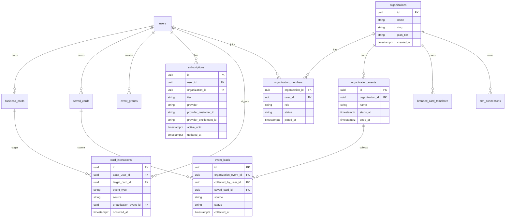

# Cardence Paketleri Teknik Mimari ve Veri Modeli

Bu dokuman Free, Premium ve Business paketlerindeki ozelliklerin Cardence'in mevcut Flutter Clean Architecture ve .NET backend mimarisine nasil oturtulacagini aciklar.

Mevcut temel:

- Flutter: `lib/features/**/domain`, `data`, `presentation` katmanlari.
- State management: BLoC/Cubit.
- Backend: `Cardence.Domain`, `Cardence.Application`, `Cardence.Infrastructure`, `Cardence.Api`.
- Abonelik: Flutter tarafinda RevenueCat (`purchases_flutter`, `purchases_ui_flutter`).
- Reklam: Flutter tarafinda Google Mobile Ads.
- Wallet/event group/profile stats: Backend ve Flutter tarafinda baslangic akislari var.

## 1. Mimari Ilkeler

1. Paket kararlari domain seviyesinde temsil edilmeli, UI icinde hard-coded olmamalidir.
2. Backend entitlement ve quota icin tek dogruluk kaynagi olmalidir.
3. Flutter presentation katmani sadece state okur ve event/cubit metodu tetikler.
4. RevenueCat sonucu sadece client tarafinda guvenilmemelidir; webhook veya backend verification ile server tarafinda eslenmelidir.
5. Business ozellikleri bireysel `User` modeline sıkıştırılmamalı; `Organization` ve `Membership` domain'i eklenmelidir.

## 2. Plan ve Entitlement Modeli

### 2.1 Domain kavramlari

Yeni veya genisletilecek kavramlar:

| Kavram | Katman | Aciklama |
| --- | --- | --- |
| `PlanTier` | Domain | `free`, `premium`, `business`, `enterprise`. |
| `Entitlement` | Domain/Application | Kullanici veya organization'in sahip oldugu haklar. |
| `QuotaPolicy` | Application | Kart, event group, export, team seat limitlerini hesaplar. |
| `Subscription` | Domain | Store/RevenueCat/Stripe kaynakli abonelik kaydi. |
| `FeatureGate` | Flutter domain | UI tarafinda ozellik acik mi kapali mi kontrolu. |

Mevcut `WalletEntitlement`:

```text
UserId
Tier = free
MaxCards = 15
UpdatedAt
```

Bu model bireysel cüzdan icin yeterli baslangic saglar, ancak Business icin genisletilmelidir.

### 2.2 Onerilen backend tablolar



### 2.3 Plan karar motoru

Backend'de `QuotaPolicyService` veya `PlanPolicyService` eklenmelidir.

Sorumluluklari:

- Kullanici veya organization planini okur.
- Business card, event group, saved card, export ve team seat limitlerini hesaplar.
- Application servislerine `CanCreateBusinessCard`, `CanCreateEventGroup`, `CanExport`, `CanUseAdvancedDesign` gibi kararlar dondurur.
- Hata durumunda standart `ApiResponse` hata kodu uretir.

Onerilen DTO:

```json
{
  "tier": "premium",
  "features": {
    "adsDisabled": true,
    "advancedDesigns": true,
    "profileStats": true,
    "csvExport": true,
    "networkGraph": true,
    "walletPass": true,
    "crmIntegration": false
  },
  "limits": {
    "maxBusinessCards": 5,
    "maxEventGroups": 0,
    "maxTeamSeats": 1
  }
}
```

`0` veya `null` limit anlami netlestirilmelidir. Tavsiye: `null` sinirsiz, pozitif sayi limit, `0` kapali.

## 3. Free Plan Teknik Uygulama

### 3.1 Kendi dijital kart limiti

Mevcut Flutter sabiti:

```text
SavedCardsWalletLimits.freeMaxOwnBusinessCards = 50
```

Urun karari 1-2 kart oldugu icin bu deger client ve backend tarafinda policy'den gelmelidir.

Backend:

- `BusinessCardService.CreateAsync` ve `UpsertAsync` icinde kullanicinin kart sayisi kontrol edilir.
- Free kullanici limit asarsa `403 PLAN_LIMIT_REACHED` veya mevcut hata standardina uygun yeni hata kodu doner.
- Premium/Business icin limit policy'den gelir.

Flutter:

- `GetSavedCardsWalletQuota` yerine daha genel `GetPlanEntitlements` use case eklenebilir.
- `my_cards` veya onboarding kart ekleme butonu, quota state'e gore paywall'a yonlendirir.
- UI hard-coded "1 kart" yazmaz; `PlanEntitlements.limits.maxBusinessCards` kullanir.

### 3.2 Event group limiti

Mevcut temel:

- Flutter: `freeMaxEventGroups = 2`.
- Backend: `WalletQuotaDto.EventGroupCount`, `MaxEventGroups`, `CanAddEventGroup`.
- Flutter: event group create akisi quota bilgisini kullanabilir.

Yapilacaklar:

1. Backend `EventGroupService.CreateAsync` icinde `CanAddEventGroup` kontrolu zorunlu olmali.
2. Flutter `CreateEventGroup` hatasinda paywall veya limit sheet gostermeli.
3. Premium icin `MaxEventGroups = null` veya `CanAddEventGroup = true` olarak donmeli.

### 3.3 Kart saklama

Kart saklama temel duzeyde acik kalmalidir. Teknik olarak iki ayri davranis ayrilabilir:

| Davranis | Free | Premium |
| --- | --- | --- |
| QR ile kaydetme | Acik | Acik |
| Manuel kart ekleme | Sinirli veya reklam destekli | Acik |
| Fotograf/OCR ile ekleme | Sinirli | Acik |
| Export | Kapali | Acik |
| Gelismis filtre/etiket | Sinirli | Acik |

Mevcut kodda `hasUnlimitedWallet => true`. Bu is karari korunacaksa `WalletQuotaDto` dilinde "saved card limit yok, ama export/advanced action limitli" seklinde temsil edilmelidir.

## 4. Premium Teknik Uygulama

### 4.1 Reklamsiz kullanim

Mevcut akista `ShowPostAddCardMonetization` subscription repo ile premium kontrolu yapabilir.

Gerekenler:

- `SubscriptionRepository.hasPremiumWalletEntitlement()` sonucunu tek basina yeterli sayma.
- Backend'den `PlanEntitlements.adsDisabled` alin.
- Reklam gosteriminden once hem local RevenueCat hem backend entitlement cache kontrol edilebilir.
- Offline durumunda son bilinen entitlement kisa sureli cache olarak kullanilabilir.

### 4.2 Gelismis kart tasarimlari

Flutter feature yapisi:

```text
lib/features/card_design/
  domain/entities/card_template.dart
  domain/repositories/card_design_repository.dart
  domain/usecases/get_card_templates.dart
  data/models/card_template_model.dart
  data/datasources/card_design_remote_datasource.dart
  data/repositories/card_design_repository_impl.dart
  presentation/cubit/card_design_cubit.dart
  presentation/widgets/
```

Business card modelinde saklanacak alanlar:

- `templateId`
- `layoutId`
- `accentColor`
- `backgroundColor`
- `fontFamily`
- `logoUrl`
- `frontVisibleFields`
- `backVisibleFields`

Kurallar:

- Free template'ler herkes tarafindan kullanilir.
- Premium template secildiginde `advancedDesigns` entitlement kontrol edilir.
- Business template'ler organization'a ait olur ve sadece organization member kullanabilir.

### 4.3 Profil istatistikleri

Mevcut endpoint:

- `GET /ProfileStats`

Gelistirilmesi gereken event kaynaklari:

| Event | Ne zaman yazilir | Premium metrik |
| --- | --- | --- |
| `card_viewed` | Public kart veya card detail goruntulenince | Kac kez goruntulendi |
| `qr_scanned` | QR payload veya public QR cozulunce | QR kac kez tarandi |
| `card_saved` | Baska kullanici cüzdanina kaydedince | Kim/kac kisi kaydetti |
| `contact_clicked` | Telefon, e-posta, LinkedIn, web tiklaninca | Ilgi aksiyonlari |

Backend:

- `card_interactions` tablosu eklenir.
- Public endpointlerde rate limit ve bot filtreleme uygulanir.
- `ProfileStatsDto` sadece sahibin kendi kartlari icin aggregation doner.

Gizlilik:

- `card_saved` eventinde actor kullanici ismi varsayilan olarak gosterilmemeli.
- "Kim kartimi kaydetti" icin kaydeden kullanicinin `allowDiscoverability` veya `shareSaveActivity` ayari gerekir.
- Aksi halde "12 kisi kaydetti" gibi aggregate veri doner.

### 4.4 CSV/Excel export

Backend endpoint onerileri:

```text
GET /ExportSavedCards?format=csv
GET /ExportEventGroupCards?id={eventGroupId}&format=csv
GET /ExportProfileInteractions?from=&to=&format=csv
```

Kurallar:

- Free: `EXPORT_NOT_ALLOWED`.
- Premium: kendi cüzdani ve kendi event group'lari.
- Business: organization event lead listeleri, role bazli yetki ile.

Teknik not:

- CSV ilk faz icin yeterlidir.
- Excel icin backend'de OpenXML/ClosedXML gibi bir paket eklenebilir.
- Buyuk export icin async job modeli gerekir: `export_jobs` tablosu, status polling, signed download URL.

### 4.5 Graph / node-dugum-bag-path yapisi

**Detayli referans:** `docs/PRICING_NETWORK_GRAPH_THEORY.md` — matematiksel model, node/edge taksonomisi, path algoritmalari, scope modelleri, API sozlesmesi ve uygulama fazlari.

Graph ozelligi iki seviyede uygulanmalidir:

1. Iliskisel DB'de edge tablolari ile kaynak veri toplanir.
2. Gorsellestirme ve graph algoritmalari ayri servis veya Application query olarak hesaplanir.

Temel graph modeli:

| Graph kavrami | Cardence karsiligi |
| --- | --- |
| Node | User, BusinessCard, Company, Event, Organization |
| Edge | saved, scanned, met_at_event, works_at, shared_contact |
| Path | A kullanicisindan B kullanicisina event veya ortak kart uzerinden bag |
| Degree | Bir node'un bag sayisi |
| Centrality | Ag icinde etkili kisi/sirket |

Ilk faz endpointleri:

```text
GET /NetworkGraph?scope=personal
GET /NetworkGraphPath?fromCardId=&toCardId=
GET /OrganizationNetworkGraph?organizationId=&eventId=
```

Onerilen response:

```json
{
  "nodes": [
    { "id": "card_123", "type": "card", "label": "Ayse Yilmaz" },
    { "id": "company_abc", "type": "company", "label": "ABC A.S." }
  ],
  "edges": [
    { "source": "card_123", "target": "company_abc", "type": "works_at", "weight": 1 }
  ]
}
```

Flutter:

- Graph algoritmasi UI'da degil backend query'de olmalidir.
- UI sadece node/edge verisini gorsellestirir.
- Feature klasoru `features/network_graph` olabilir.

### 4.6 Apple Wallet / Google Wallet

Bu ozellik premium'da yer almali, cunku teknik maliyeti ve algilanan degeri yuksektir.

Backend sorumluluklari:

- Apple PassKit icin `.pkpass` uretimi ve imzalama.
- Google Wallet Generic Pass veya Business Card pass olusturma.
- Pass update icin kart degisikliklerinde push/update mekanizmasi.
- Sertifika ve private key secret yonetimi.

Flutter sorumluluklari:

- "Wallet'a ekle" butonu.
- Backend'den pass URL veya token alma.
- Platforma gore Apple/Google akisini baslatma.

Endpoint onerileri:

```text
POST /WalletPasses/Apple?cardId=
POST /WalletPasses/Google?cardId=
GET /WalletPasses/Status?cardId=
```

## 5. Business Teknik Uygulama

### 5.1 Organization ve ekip uyeleri

Yeni backend domain:

```text
Cardence.Domain/Entities/Organization.cs
Cardence.Domain/Entities/OrganizationMember.cs
Cardence.Domain/Entities/OrganizationInvitation.cs
Cardence.Domain/Enums/OrganizationRole.cs
```

Roller:

| Role | Yetki |
| --- | --- |
| Owner | Billing, silme, tum ayarlar |
| Admin | Uye yonetimi, event, export, CRM |
| Manager | Event ve lead yonetimi |
| Member | Lead toplama, kendi performansi |
| Viewer | Raporlari goruntuleme |

Backend Application servisleri:

- `IOrganizationService`
- `IOrganizationMemberService`
- `IOrganizationInvitationService`
- `IOrganizationPlanService`

Flutter feature:

```text
lib/features/organizations/
  domain/entities/
  domain/repositories/
  domain/usecases/
  data/models/
  data/datasources/
  data/repositories/
  presentation/bloc/
  presentation/pages/
  presentation/widgets/
```

### 5.2 Etkinlik bazli kisi toplama ve lead listesi

Mevcut `event_groups` bireysel cüzdan icin kullanisli. Business icin ayrica `organization_events` gerekir.

Fark:

| Kavram | Bireysel EventGroup | Business OrganizationEvent |
| --- | --- | --- |
| Sahiplik | User | Organization |
| Amac | Saved card gruplama | Lead toplama ve ekip raporu |
| Uye | Yok | Team member |
| Export | Premium bireysel | Business |
| CRM | Yok | Var |

Lead toplama kaynaklari:

- QR scan.
- Manuel kart ekleme.
- OCR/photo scan.
- Public form.
- Badge scan entegrasyonu.
- Import CSV.

`event_leads` alanlari:

- `organizationEventId`
- `savedCardId`
- `collectedByUserId`
- `source`
- `status`
- `notes`
- `tags`
- `followUpAt`
- `createdAt`

### 5.3 CRM entegrasyonu

CRM entegrasyonu Business planin en kritik gelir ozelliklerinden biridir.

Backend model:

```text
crm_connections
  id
  organization_id
  provider
  access_token_encrypted
  refresh_token_encrypted
  scopes
  status
  updated_at

crm_sync_jobs
  id
  crm_connection_id
  organization_event_id
  status
  started_at
  finished_at
  error_message
```

Ilk provider sirasi:

1. HubSpot
2. Pipedrive
3. Salesforce
4. Zoho

Akis:

1. Admin CRM provider secip OAuth baglar.
2. Backend encrypted token saklar.
3. Admin event lead listesinden "CRM'e aktar" der.
4. Backend async sync job baslatir.
5. Flutter job status izler.

### 5.4 Marka logolu kart sablonlari

Business template modeli:

```text
branded_card_templates
  id
  organization_id
  name
  logo_url
  primary_color
  secondary_color
  font_family
  layout_json
  is_locked
  created_at
```

Kurallar:

- Organization admin template olusturur.
- Member kendi kartini bu template ile olusturabilir.
- `is_locked = true` ise renk/logo degistirilemez.
- Flutter tarafinda yine `AppColors` ve tema kurallarina uyulmalidir; ham `Color(0x...)` yerine backend'den gelen hex modelde tutulur, UI render ederken kontrollu parse edilir.

### 5.5 Ekip analitigi

Event ve ekip metrikleri:

- Team member basina lead sayisi.
- Scan -> saved conversion.
- Lead status dagilimi.
- Follow-up gecikme metrikleri.
- Event bazli sirket/rol dagilimi.
- Graph merkezi node'lar.

Endpointler:

```text
GET /Organizations/{id}/Analytics
GET /OrganizationEvents/{id}/Analytics
GET /OrganizationEvents/{id}/TeamPerformance
GET /OrganizationEvents/{id}/Leads
```

Mevcut API konvansiyonu duz PascalCase path kullandigi icin gercek implementasyonda proje standardina gore su sekilde isimlendirilebilir:

```text
GET /OrganizationAnalytics?id=
GET /OrganizationEventAnalytics?id=
GET /OrganizationEventTeamPerformance?id=
GET /OrganizationEventLeads?id=
```

## 6. Guvenlik ve Gizlilik

Zorunlu kararlar:

1. Backend tum organization endpointlerinde membership ve role kontrolu yapmali.
2. Export ve CRM islemleri audit log'a yazilmali.
3. "Kim kartimi kaydetti" ozelligi gizlilik iznine baglanmali.
4. CRM token'lari plaintext saklanmamali.
5. Public card view/scan endpointleri rate limit ile korunmali.
6. Business musterileri icin data retention ve delete/export talepleri desteklenmeli.

## 7. Test Stratejisi

Backend:

- Quota policy unit testleri.
- Business role authorization testleri.
- RevenueCat webhook signature testleri.
- Export permission testleri.
- CRM sync job failure/retry testleri.

Flutter:

- Feature gate unit testleri.
- Paywall tetikleyici cubit/bloc testleri.
- Premium entitlement cache testleri.
- Organization role'a gore UI state testleri.

Integration:

- Free -> limit -> paywall -> premium entitlement -> ozellik acilir.
- Business admin -> event yaratir -> member lead toplar -> admin export eder.
- Kart scan -> `card_interactions` yazilir -> profile stats aggregation guncellenir.
