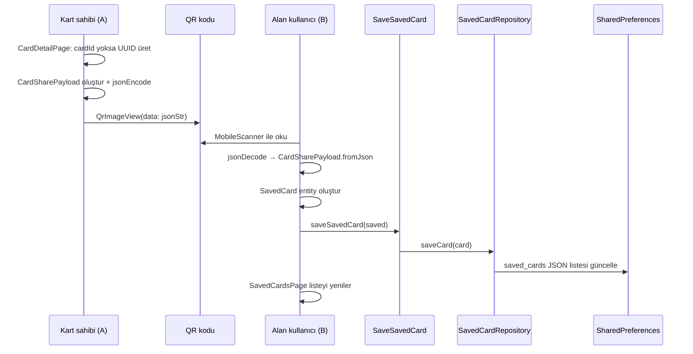
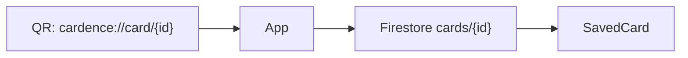

# Cardence – QR ile Kart Paylaşımı ve Cüzdana Ekleme

Bu doküman, Cardence projesinde **bir kullanıcının kartını QR ile paylaşması** ve **başka bir kullanıcının bu kartı kendi cüzdanına (Kaydedilen Kartlar) eklemesi** akışının mevcut mimarisini, veri sözleşmesini, kod haritasını ve geliştirme yollarını açıklar.

---

## 1. Özet

| Rol | Ne yapar | Nerede |
|-----|----------|--------|
| **Kart sahibi (A)** | Kart bilgilerini JSON olarak QR’a kodlar, ekranda gösterir | `CardDetailPage` → QR ile paylaş |
| **Alan (B)** | QR’ı okur, JSON’u parse eder, `SavedCard` olarak cihazda saklar | `ScanCardQrPage` → `SaveSavedCard` |
| **Cüzdan** | Kayıtlı kartları listeler, detay/not ekler | `SavedCardsPage` |

**Önemli:** Akış şu an **sunucusuz (peer-to-peer)** çalışır. QR içinde kartın **tüm paylaşılan alanları** taşınır; okuyan taraf veriyi doğrudan kendi cihazına yazar. Firebase kart deposu bu akışta henüz kullanılmaz.

---

## 2. Uçtan uca akış



### Kullanıcı yolculuğu (A – paylaşan)

1. **Profil → Kartı düzenle → Tasarım ve paylaşım** veya **Kart görünümü → Tasarım ve QR paylaşımı**
2. `CardDetailPage` açılır
3. **QR ile paylaş** butonuna basılır
4. Kartta `cardId` yoksa UUID üretilir ve onboarding taslağına kaydedilir
5. Dialog içinde QR gösterilir

### Kullanıcı yolculuğu (B – alan)

1. **Kaydedilen Kartlar** sekmesinde QR tarama ekranına girilir *(ekran kodda var; navigasyon henüz bağlanmamış olabilir — bkz. §7)*
2. `mobile_scanner` ile QR okunur
3. JSON parse edilir → `SavedCard` → yerel cüzdana yazılır
4. Liste ekranında kart görünür; detayda not (arka yüz) eklenebilir

---

## 3. Veri sözleşmesi: `CardSharePayload`

**Dosya:** `lib/features/saved_cards/domain/entities/card_share_payload.dart`

QR içeriği **tek satırlık JSON** string’idir. Alan adları kısa tutulmuştur (QR boyutu için).

| JSON anahtarı | Alan | Zorunlu |
|---------------|------|---------|
| `id` | Kart benzersiz kimliği (`cardId`) | Evet |
| `n` | Ad soyad (`displayName`) | Hayır |
| `e` | E-posta | Hayır |
| `p` | Telefon | Hayır |
| `c` | Şirket | Hayır |
| `t` | Ünvan | Hayır |
| `w` | Web sitesi | Hayır |
| `l` | LinkedIn | Hayır |
| `s` | Yetenekler | Hayır |
| `o` | Okul | Hayır |
| `h` | Hakkımda | Hayır |

**Örnek QR içeriği:**

```json
{"id":"8f3c2a1b-4d5e-6f7a-8b9c-0d1e2f3a4b5c","n":"Ayşe Yılmaz","e":"ayse@firma.com","p":"+905551234567","t":"Ürün Müdürü","c":"Firma A.Ş."}
```

**Doğrulama kuralları (`fromJson`):**

- `json == null` veya `id` yok → geçersiz, kart kaydedilmez
- Boş string alanlar `toJson` sırasında QR’a eklenmez

---

## 4. Cüzdan modeli: `SavedCard`

**Dosya:** `lib/features/saved_cards/domain/entities/saved_card.dart`

QR’dan gelen payload, alıcı tarafta `SavedCard` entity’sine dönüştürülür:

```dart
SavedCard(
  cardId: payload.id,
  displayName: payload.n,
  email: payload.e,
  phone: payload.p,
  company: payload.c,
  title: payload.t,
  website: payload.w,
  linkedin: payload.l,
  skills: payload.s,
  school: payload.o,
  about: payload.h,
  savedAt: DateTime.now().millisecondsSinceEpoch,
)
```

**Not:** `about` alanı QR’dan gelirse kart sahibinin “hakkımda” metnidir. Alıcı daha sonra kendi **kişisel notunu** aynı `about` alanına yazabilir (detay ekranı); bu, paylaşılan verinin üzerine yazılır — tasarım kararı olarak bilinmeli.

---

## 5. Katmanlı mimari (Clean Architecture)

```
presentation/
  scan_card_qr_page.dart      → QR okuma UI, SaveSavedCard çağırır
  saved_cards_page.dart       → Cüzdan listesi
  saved_card_detail_page.dart → Detay + not

domain/
  entities/
    card_share_payload.dart   → QR sözleşmesi
    saved_card.dart           → Cüzdan kartı
  repositories/
    saved_card_repository.dart (abstract)
  usecases/
    get_saved_cards.dart
    save_saved_card.dart

data/
  models/saved_card_model.dart
  datasources/saved_card_local_datasource.dart  → SharedPreferences
  repositories/saved_card_repository_impl.dart
```

**Bağımlılık enjeksiyonu:** `lib/core/init/app_init.dart`

```text
SharedPreferences
  → SavedCardLocalDataSourceImpl
  → SavedCardRepositoryImpl
  → GetSavedCards / SaveSavedCard
  → App → MainShellPage → SavedCardsPage / ScanCardQrPage
```

Presentation katmanı doğrudan `SharedPreferences` veya `mobile_scanner` kullanmaz (scanner yalnızca sayfa widget’ında); kalıcılık **use case → repository** üzerinden yapılır.

---

## 6. Kod referansları

### 6.1 QR üretimi (paylaşan)

**Dosya:** `lib/features/my_cards/presentation/pages/card_detail_page.dart`  
**Metod:** `_showShareQrDialog()`

- Paket: `qr_flutter` (`QrImageView`)
- `cardId` yoksa `Uuid().v4()` ile oluşturulup `saveOnboardingDraftCard` ile kaydedilir
- `jsonEncode(payload.toJson())` QR `data` alanına verilir

### 6.2 QR okuma (alan)

**Dosya:** `lib/features/saved_cards/presentation/pages/scan_card_qr_page.dart`

| Adım | İşlem |
|------|--------|
| 1 | `MobileScanner.onDetect` → `barcodes.first.rawValue` |
| 2 | `jsonDecode(code)` |
| 3 | `CardSharePayload.fromJson(map)` |
| 4 | `SavedCard(...)` oluştur |
| 5 | `saveSavedCard(saved)` |
| 6 | `Navigator.pop(true)` |

**Kısıtlar:**

- Web (`kIsWeb`): kamera desteklenmez, bilgi mesajı gösterilir
- `_isProcessing` ile çift okuma engellenir
- Hatalı JSON veya geçersiz payload → SnackBar

### 6.3 Yerel depolama

**Anahtar:** `saved_cards` (`SharedPreferences`)  
**Dosya:** `lib/features/saved_cards/data/datasources/saved_card_local_datasource.dart`

- Liste JSON array olarak saklanır
- Aynı `cardId` ile kayıt varsa **güncellenir** (upsert), yoksa eklenir
- Sunucu senkronizasyonu yok; veri yalnızca cihazda

### 6.4 Cüzdan listesi

**Dosya:** `lib/features/saved_cards/presentation/pages/saved_cards_page.dart`

- `getSavedCards()` ile liste yüklenir
- Liste boşsa şu an **dummy kartlar** gösterilir (geliştirme/demo)
- Gerçek QR ile kaydedilen kartlar `_cards` dolu olduğunda dummy yerine gerçek veri kullanılır

---

## 7. Mevcut durum ve eksikler

| Konu | Durum |
|------|--------|
| QR üretimi | Çalışır (`CardDetailPage`) |
| QR okuma ekranı | Kod hazır (`ScanCardQrPage`) |
| Navigasyon (Kaydedilen Kartlar → QR tara) | **Henüz bağlı değil** — `ScanCardQrPage` hiçbir sayfadan `Navigator.push` edilmiyor |
| Bulut / canlı kart güncelleme | Yok — QR anlık snapshot |
| Kimlik doğrulama / imza | Yok — herkes sahte JSON QR üretebilir |
| Kart sahibi tasarımı (renk, alan düzeni) | QR’a **dahil değil** — yalnızca metin alanları |
| Web QR tarama | Desteklenmiyor |

---

## 8. Çözüm yolları

### 8.1 Kısa vade — Akışı tamamlamak (önerilen ilk adım)

**Hedef:** Kullanıcı Kaydedilen Kartlar’dan QR okuyup cüzdana ekleyebilsin.

1. `SavedCardsPage` veya `MainShellPage` AppBar’ına **QR ile kart al** FAB / butonu ekle
2. Navigasyon:

```dart
final added = await Navigator.of(context).push<bool>(
  MaterialPageRoute(
    builder: (_) => ScanCardQrPage(
      saveSavedCard: widget.saveSavedCard,
    ),
  ),
);
if (added == true) _loadCards();
```

3. Dummy kartları prod’da kaldır veya yalnızca debug’da göster
4. Başarı SnackBar: “Kart cüzdanınıza eklendi”

**Efor:** düşük · **Mimari:** mevcut use case yeterli

---

### 8.2 Orta vade — QR’da yalnızca ID (sunucu destekli)

**Hedef:** QR küçülür; kart güncellenince alıcılar son sürümü çekebilir.



**Adımlar:**

1. `CardSharePayload` v2: `{ "v": 2, "id": "..." }` veya deep link URL
2. `CardDetailPage` QR’ı sadece ID ile üret
3. Yeni use case: `FetchSharedCardById` → Firestore’dan oku → `SavedCard`
4. `ScanCardQrPage`: ID ise fetch, eski JSON ise geriye dönük parse (v1 uyumluluk)
5. Firestore security rules: okuma public veya token ile

**Artılar:** Güncel veri, daha küçük QR  
**Eksiler:** İnternet gerekir, backend maliyeti

---

### 8.3 Orta vade — Güvenlik ve güven

| Önlem | Açıklama |
|--------|----------|
| İmzalı payload | HMAC veya JWT ile `id` + alanlar imzalanır; sahte QR reddedilir |
| Süre sınırı | QR’da `exp` timestamp; süresi dolmuş kod reddedilir |
| Kart sahibi onayı | “Bu cihaz kartımı kaydetti” push/bildirimi (opsiyonel) |

Domain’de `ValidateCardSharePayload` use case; data’da imza doğrulama.

---

### 8.4 Uzun vade — Ürün olgunluğu

- **Deep link / Universal link:** QR dışında link ile kart ekleme
- **vCard (.vcf):** Sistem rehberine aktarım
- **Çoklu cihaz senkron:** Cüzdan Firebase’de kullanıcı hesabına bağlı
- **Etkinlik grubu etiketi:** QR okutunca “Konferans 2025” grubuna otomatik etiket
- **Offline kuyruk:** Fetch başarısızsa ID kuyruğa alınır, ağ gelince tamamlanır

---

## 9. Test senaryoları

| # | Senaryo | Beklenen |
|---|---------|----------|
| 1 | Geçerli Cardence QR okut | Cüzdana yeni kart, `savedAt` set |
| 2 | Aynı `id` ile tekrar okut | Upsert; duplicate satır yok |
| 3 | Geçersiz JSON | “QR içeriği okunamadı” |
| 4 | JSON var ama `id` yok | “Geçersiz kart kodu” |
| 5 | iOS/Android gerçek cihaz | Kamera açılır, tarama çalışır |
| 6 | Web | Desteklenmiyor mesajı |
| 7 | A paylaşır → B okur → A bilgilerini günceller | B’de **eski** veri kalır (v1 davranış) |

---

## 10. İlgili paketler

| Paket | Kullanım |
|-------|----------|
| `qr_flutter` | QR görseli üretimi |
| `mobile_scanner` | Kamera ile QR okuma |
| `shared_preferences` | Cüzdan yerel depolama |
| `uuid` | Paylaşım öncesi `cardId` üretimi |

---

## 11. Özet karar matrisi

| İhtiyaç | Önerilen yol |
|---------|----------------|
| Hemen demo / MVP | §8.1 — Navigasyonu bağla |
| Kart güncellenince alıcıda da güncellensin | §8.2 — ID + Firestore |
| Sahte QR riski | §8.3 — İmzalı payload |
| Kurumsal / ölçek | §8.4 — Sync + deep link |

---

*Son güncelleme: proje kod tabanına göre (Cardence v1.0.0). Kod değiştikçe bu dosyayı güncelleyin.*
