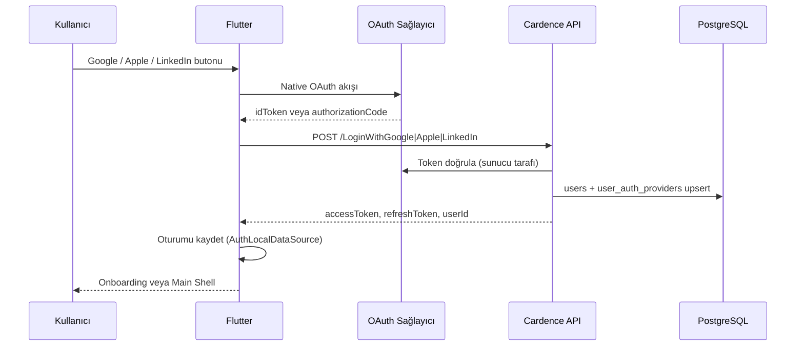
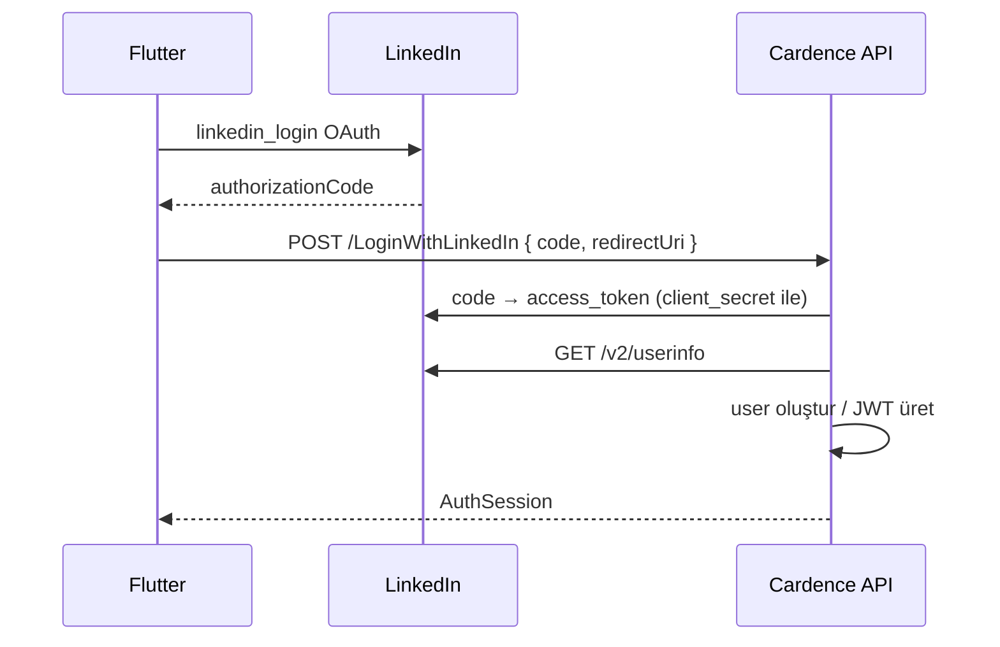

# Cardence – Google / Apple / LinkedIn Giriş Bağlantı Rehberi

Bu doküman, Cardence uygulamasında **Google**, **Apple** ve **LinkedIn** ile girişin nasıl bağlanacağını adım adım açıklar.

> **Mevcut durum (2026-06):** E-posta, telefon ve şifre ile giriş **çalışıyor** (Cardence .NET API + JWT). Google / Apple / LinkedIn butonları login ekranında görünür ancak `onPressed: null` — henüz bağlı değil. Backend’de `/LoginWithGoogle`, `/LoginWithApple`, `/LoginWithLinkedIn` endpoint’leri **planlandı**, henüz implemente edilmedi.

---

## İçindekiler

1. [Mimari özeti](#1-mimari-özeti)
2. [Ortak akış](#2-ortak-akış)
3. [Google ile giriş](#3-google-ile-giriş)
4. [Apple ile giriş](#4-apple-ile-giriş)
5. [LinkedIn ile giriş](#5-linkedin-ile-giriş)
6. [Backend API sözleşmesi](#6-backend-api-sözleşmesi)
7. [Veritabanı](#7-veritabanı)
8. [Flutter entegrasyonu](#8-flutter-entegrasyonu)
9. [Test kontrol listesi](#9-test-kontrol-listesi)
10. [Güvenlik notları](#10-güvenlik-notları)

---

## 1. Mimari özeti

Cardence artık oturumu **Firebase Auth** ile değil, **Cardence API JWT** ile yönetir.

```
┌─────────────┐     idToken / authCode      ┌──────────────────┐
│   Flutter   │ ──────────────────────────► │  Cardence API    │
│  (mobil)    │ ◄── accessToken + refresh ─ │  (.NET + JWT)    │
└─────────────┘                             └──────────────────┘
       │                                              │
       │ google_sign_in                               │ Token doğrulama
       │ sign_in_with_apple                           │ (Google / Apple / LinkedIn)
       │ linkedin_login                               ▼
       │                                     ┌──────────────────┐
       └────────────────────────────────────►│   PostgreSQL     │
                                             │ users + providers│
                                             └──────────────────┘
```

| Katman | Sorumluluk |
|--------|------------|
| **Flutter** | Native OAuth SDK ile kullanıcıyı sağlayıcıda oturum açtırır; token/code’u backend’e gönderir |
| **Backend** | Sağlayıcı token’ını doğrular; `users` + `user_auth_providers` kaydı açar/günceller; JWT üretir |
| **Local (Flutter)** | `accessToken` / `refreshToken` saklanır; mevcut `AuthRepository` akışı kullanılır |

**Provider sabitleri:** `lib/core/constants/auth_constants.dart`

| Sağlayıcı | `providerId` |
|-----------|--------------|
| Google | `google.com` |
| Apple | `apple.com` |
| LinkedIn | `linkedin.com` |

**Uygulama kimliği:** `com.furkanages.cardenceapp`  
**API base URL:** `https://cardenceapi.app` (`lib/core/network/api_config.dart`)

---

## 2. Ortak akış



Tüm sosyal girişler aynı oturum modelini döndürmelidir (`AuthSessionModel`):

```json
{
  "success": true,
  "entity": {
    "accessToken": "eyJ...",
    "refreshToken": "...",
    "userId": "3fa85f64-5717-4562-b3fc-2c963f66afa6",
    "expiresIn": 3600,
    "email": "user@example.com",
    "phone": null,
    "displayName": "Ad Soyad"
  },
  "message": "Giriş başarılı."
}
```

---

## 3. Google ile giriş

### 3.1 Paket

`pubspec.yaml` içinde zaten tanımlı:

```yaml
google_sign_in: ^6.2.2
```

### 3.2 Google Cloud Console

1. [Google Cloud Console](https://console.cloud.google.com/) → proje seç / oluştur.
2. **APIs & Services → OAuth consent screen** → External → uygulama adı, destek e-postası, logo.
3. **Credentials → Create Credentials → OAuth client ID**

| Platform | Client türü | Not |
|----------|-------------|-----|
| **Android** | Android | Package: `com.furkanages.cardenceapp`, SHA-1 fingerprint ekle |
| **iOS** | iOS | Bundle ID: `com.furkanages.cardenceapp` |
| **Backend (Web)** | Web application | Token doğrulama için — **Client ID backend’de kullanılır** |

4. Android SHA-1 almak için:

```bash
cd android && ./gradlew signingReport
# veya debug keystore:
keytool -list -v -keystore ~/.android/debug.keystore -alias androiddebugkey -storepass android -keypass android
```

5. `google-services.json` (Android) ve `GoogleService-Info.plist` (iOS) indir — `.gitignore`’da; CI/CD veya yerel olarak eklenmeli.

### 3.3 Android yapılandırması

`android/app/build.gradle.kts` — `applicationId` zaten `com.furkanages.cardenceapp`.

- `android/app/google-services.json` dosyasını ekle (Firebase/Google Sign-In plugin kullanılıyorsa).
- Minimum SDK: 21+ (mevcut).

### 3.4 iOS yapılandırması

1. `ios/Runner/GoogleService-Info.plist` ekle (gitignore dışında tutuluyor).
2. Xcode → **Runner → Info → URL Types**:
   - **URL Schemes:** `REVERSED_CLIENT_ID` (`GoogleService-Info.plist` içindeki `REVERSED_CLIENT_ID` değeri).
3. Bundle ID: `com.furkanages.cardenceapp` (`ios/Runner.xcodeproj`).

### 3.5 Backend yapılandırması

`backend/Cardence.Api/appsettings.json`:

```json
"GoogleAuth": {
  "ClientId": "YOUR_WEB_CLIENT_ID.apps.googleusercontent.com"
}
```

> **Önemli:** Backend token doğrulamasında genelde **Web client ID** kullanılır. Android/iOS client ID’leri mobil SDK içindir; `GoogleJsonWebSignature.ValidateAsync` ile `audience` olarak web client ID beklenir.

**Önerilen NuGet paketi:** `Google.Apis.Auth`

Doğrulama mantığı (özet):

```csharp
// POST /LoginWithGoogle
// 1. idToken al
// 2. GoogleJsonWebSignature.ValidateAsync(idToken, validationSettings)
// 3. email, sub (google user id), name, picture
// 4. user_auth_providers (google.com, sub) → user bul/oluştur
// 5. JWT session döndür
```

### 3.6 Flutter akışı (implementasyon taslağı)

```dart
final googleUser = await GoogleSignIn(
  scopes: ['email', 'profile'],
).signIn();

final auth = await googleUser?.authentication;
final idToken = auth?.idToken;
if (idToken == null) throw AuthApiException('Google oturumu alınamadı.');

// AuthRemoteDataSource → POST /LoginWithGoogle
final session = await remote.loginWithGoogle(idToken: idToken);
await local.saveSession(session);
```

Login ekranındaki Google butonu: `lib/features/auth/presentation/pages/login_page.dart` → `_buildExtendedFooter()` içinde şu an `onPressed: null`.

---

## 4. Apple ile giriş

### 4.1 Paket

```yaml
sign_in_with_apple: ^6.1.3
```

### 4.2 Apple Developer

1. [Apple Developer](https://developer.apple.com/) → **Certificates, Identifiers & Profiles**.
2. **Identifiers → App ID** (`com.furkanages.cardenceapp`):
   - **Sign In with Apple** capability’yi etkinleştir.
3. **Keys** (opsiyonel, backend doğrulama için): Sign in with Apple key oluştur — client secret üretiminde kullanılır (web/backend flow).
4. App Store Connect’te uygulama kaydı yapılmış olmalı (TestFlight / production).

### 4.3 iOS yapılandırması

Xcode → **Runner → Signing & Capabilities**:

- **+ Capability → Sign in with Apple**

`backend/Cardence.Api/appsettings.json`:

```json
"AppleAuth": {
  "ClientId": "com.furkanages.cardenceapp"
}
```

> Apple **identity token** doğrulamasında `aud` (audience) = Bundle ID / Services ID olmalıdır.

### 4.4 Android (opsiyonel)

Apple, Android için web tabanlı Sign in with Apple sunar. `sign_in_with_apple` paketi Android’i destekler; redirect URI ve Services ID gerekir. Cardence’te öncelik **iOS**; Android’de Apple butonu gizlenebilir veya sonra eklenir.

### 4.5 Backend doğrulama

1. Identity token (JWT) al.
2. Apple JWKS endpoint’inden public key ile imzayı doğrula: `https://appleid.apple.com/auth/keys`
3. `iss` = `https://appleid.apple.com`
4. `aud` = `com.furkanages.cardenceapp`
5. `sub` → `user_auth_providers.provider_user_id` (`apple.com`)

**Önerilen:** `AspNet.Security.OAuth.Apple` veya manuel JWT validation.

### 4.6 Flutter akışı (implementasyon taslağı)

```dart
final credential = await SignInWithApple.getAppleIDCredential(
  scopes: [
    AppleIDAuthorizationScopes.email,
    AppleIDAuthorizationScopes.fullName,
  ],
);

final identityToken = credential.identityToken;
if (identityToken == null) throw AuthApiException('Apple oturumu alınamadı.');

// İlk girişte Apple ad/soyad verebilir — backend'e gönder
final session = await remote.loginWithApple(
  identityToken: identityToken,
  authorizationCode: credential.authorizationCode,
  givenName: credential.givenName,
  familyName: credential.familyName,
);
```

**Not:** Apple ilk girişten sonra ad/soyad tekrar göndermeyebilir; backend ilk kayıtta `displayName`’i saklamalıdır.

---

## 5. LinkedIn ile giriş

LinkedIn’in hazır Firebase provider’ı yoktur. Cardence mimarisinde **backend token exchange** önerilir.

### 5.1 Paket

```yaml
linkedin_login: ^2.2.1
```

### 5.2 LinkedIn Developer Portal

1. [LinkedIn Developer Portal](https://www.linkedin.com/developers/) → **Create app**.
2. **Auth** sekmesi:
   - **Redirect URLs** ekle (mobil deep link veya custom scheme).
   - Örnek: `https://cardenceapi.app/auth/linkedin/callback` (backend callback)  
     ve/veya `com.furkanages.cardenceapp://linkedin/callback` (mobil).
3. **Products** → **Sign In with LinkedIn using OpenID Connect** (veya Legacy OAuth) etkinleştir.
4. **Client ID** ve **Client Secret** al — **Client Secret yalnızca backend’de** saklanır.

### 5.3 Önerilen akış (Authorization Code → Backend)



**Alternatif:** Flutter access token alır → backend’e gönderir → backend LinkedIn API ile doğrular. Bu yöntem daha az güvenlidir; **authorization code + backend exchange** tercih edilir.

### 5.4 Backend yapılandırması (eklenecek)

`appsettings.json` şablonu:

```json
"LinkedInAuth": {
  "ClientId": "YOUR_LINKEDIN_CLIENT_ID",
  "ClientSecret": "ENV_OR_SECRET_STORE",
  "RedirectUri": "https://cardenceapi.app/auth/linkedin/callback"
}
```

> `ClientSecret` asla Flutter’a veya git’e konmamalı. Production’da environment variable / secret manager kullanın.

### 5.5 Flutter akışı (implementasyon taslağı)

`linkedin_login` paketi ile:

```dart
// LinkedInLogin widget veya LinkedInUserManager
// Başarılı callback'te authorizationCode veya token backend'e

final session = await remote.loginWithLinkedIn(
  authorizationCode: code,
  redirectUri: redirectUri,
);
```

Login ekranına üçüncü sosyal buton (LinkedIn) eklenebilir; şu an yalnızca Google ve Apple placeholder var.

---

## 6. Backend API sözleşmesi

Planlanan endpoint’ler (`backend/docs/dotnet-backend-api.md` ile uyumlu PascalCase path):

### POST `/LoginWithGoogle`

**Request:**

```json
{
  "idToken": "eyJhbGciOiJSUzI1NiIs...",
  "udId": "optional-device-id"
}
```

**Response:** Standart `AuthSessionEntity` zarfı (Bölüm 2).

**Hata kodları:**

| Kod | Açıklama |
|-----|----------|
| 400 | `idToken` eksik / geçersiz |
| 401 | Google token doğrulanamadı |
| 409 | E-posta başka sağlayıcıya bağlı (hesap birleştirme politikasına göre) |

---

### POST `/LoginWithApple`

**Request:**

```json
{
  "identityToken": "eyJraWQiOi...",
  "authorizationCode": "optional-for-refresh",
  "givenName": "Furkan",
  "familyName": "Çağlar",
  "udId": "optional-device-id"
}
```

**Response:** Aynı oturum zarfı.

---

### POST `/LoginWithLinkedIn`

**Request (code exchange — önerilen):**

```json
{
  "authorizationCode": "AQT...",
  "redirectUri": "https://cardenceapi.app/auth/linkedin/callback",
  "udId": "optional-device-id"
}
```

**Response:** Aynı oturum zarfı.

---

### Backend implementasyon checklist

- [ ] `IExternalAuthService` — Google / Apple / LinkedIn token doğrulama
- [ ] `IUserAuthProviderRepository` — `user_auth_providers` CRUD
- [ ] `AuthService.LoginWithGoogleAsync` / `LoginWithAppleAsync` / `LoginWithLinkedInAsync`
- [ ] `AuthenticationController` endpoint’leri
- [ ] Migration: `user_auth_providers` tablosu
- [ ] Unit test: geçersiz token, yeni kullanıcı, mevcut kullanıcı, email çakışması

Referans: `backend/Cardence.Application/Services/AuthService.cs` → `CreateSessionAsync` mevcut JWT üretimini kullanır.

---

## 7. Veritabanı

Planlanan tablo (`backend/docs/database-design.md` §7.2):

```sql
CREATE TABLE user_auth_providers (
  user_id           UUID NOT NULL REFERENCES users(id) ON DELETE CASCADE,
  provider_id       VARCHAR(50) NOT NULL,   -- google.com | apple.com | linkedin.com
  provider_user_id  VARCHAR(200) NOT NULL,
  PRIMARY KEY (provider_id, provider_user_id)
);
```

**OAuth giriş akışı:**

1. Token doğrula → `provider_id` + `provider_user_id` (Google `sub`, Apple `sub`, LinkedIn `sub`)
2. `user_auth_providers` kaydı var mı?
   - **Evet** → ilişkili `users` satırından JWT üret
   - **Hayır** → email ile mevcut kullanıcı var mı?
     - Politika A: aynı email → provider link et
     - Politika B: hata döndür (409)
   - **Yeni kullanıcı** → `users` INSERT + `user_auth_providers` INSERT
3. `CreateSessionAsync` ile JWT döndür

---

## 8. Flutter entegrasyonu

Clean Architecture katmanları (`/.cursor/rules/clean-architecture.mdc`):

### 8.1 Domain

`lib/features/auth/domain/repositories/auth_repository.dart` — metodlar ekle:

```dart
Future<AuthSession> loginWithGoogle({required String idToken});
Future<AuthSession> loginWithApple({required String identityToken, ...});
Future<AuthSession> loginWithLinkedIn({required String authorizationCode, required String redirectUri});
```

Use case’ler: `LoginWithGoogle`, `LoginWithApple`, `LoginWithLinkedIn`.

### 8.2 Data

| Dosya | Görev |
|-------|-------|
| `auth_remote_datasource.dart` | `POST /LoginWithGoogle` vb. |
| `auth_repository_impl.dart` | Remote + local session kaydı |
| `auth_local_datasource.dart` | Değişiklik yok (mevcut token saklama) |

### 8.3 Presentation

| Dosya | Görev |
|-------|-------|
| `login_bloc.dart` | `LoginWithGoogleRequested` event’leri |
| `login_page.dart` | Sosyal buton `onPressed` → bloc event |
| `login_method_selector.dart` | Değişiklik gerekmez (email/phone segment) |

### 8.4 DI

`lib/core/init/app_init.dart` — yeni use case’leri `App` / `AppInitResult`’a enjekte et.

### 8.5 UI durumu

Login ekranı (`login_page.dart`):

- Google butonu: `onPressed: null` → bloc handler bağlanacak
- Apple butonu: `onPressed: null` → bloc handler bağlanacak
- LinkedIn butonu: henüz UI’da yok — eklenebilir

---

## 9. Test kontrol listesi

### Konsol / yapılandırma

- [ ] Google Cloud: Android SHA-1, iOS client, Web client (backend)
- [ ] Apple Developer: Sign in with Apple capability
- [ ] LinkedIn Developer: Redirect URI, OpenID Connect product
- [ ] Backend secrets production’da env variable

### Backend (Swagger / curl)

```bash
# Örnek — gerçek idToken ile
curl -X POST https://cardenceapi.app/LoginWithGoogle \
  -H "Content-Type: application/json" \
  -d '{"idToken":"..."}'
```

- [ ] Yeni kullanıcı → JWT + `user_auth_providers` kaydı
- [ ] Aynı provider ile tekrar giriş → aynı userId
- [ ] Geçersiz token → 401
- [ ] Refresh token akışı (`/RefreshAuthentication`) sosyal giriş sonrası çalışıyor

### Flutter

- [ ] Android: Google Sign-In gerçek cihazda
- [ ] iOS: Apple Sign-In gerçek cihazda (Simulator sınırlı)
- [ ] LinkedIn: OAuth redirect doğru dönüyor
- [ ] Oturum süresi dolunca mevcut `SessionExpiredDialog` + logout
- [ ] İlk giriş → onboarding; tamamlanmış → main shell

---

## 10. Güvenlik notları

1. **Token doğrulama yalnızca backend’de** — Flutter’dan gelen idToken/code’a güvenilmez; sunucu sağlayıcı API’si ile doğrular.
2. **Client secret (LinkedIn)** yalnızca backend’de.
3. **JWT SigningKey** production’da güçlü ve gizli tutulmalı (`appsettings.json` içindeki placeholder değiştirilmeli).
4. **Hesap birleştirme** politikası net tanımlanmalı (aynı email, farklı provider).
5. **Apple gizli email** (`privaterelay.appleid.com`) — kullanıcı profilinde gerçek email olmayabilir.
6. Eski `docs/LOGIN_METHODS.md` Firebase odaklıdır; bu proje **Firebase Auth oturumu kullanmaz**. Firebase paketleri (`firebase_auth`, `firebase_core`) `pubspec.yaml`’da legacy olarak durabilir; sosyal giriş için **backend JWT** akışı esas alınmalıdır.

---

## İlgili dosyalar

| Dosya | Açıklama |
|-------|----------|
| `lib/core/constants/auth_constants.dart` | Provider enum ve ID’ler |
| `lib/features/auth/data/datasources/auth_remote_datasource.dart` | Mevcut REST auth |
| `lib/features/auth/presentation/pages/login_page.dart` | Sosyal buton UI |
| `backend/Cardence.Application/Services/AuthService.cs` | JWT oturum üretimi |
| `backend/Cardence.Api/appsettings.json` | GoogleAuth / AppleAuth |
| `backend/docs/dotnet-backend-api.md` §4 | Auth stratejisi |
| `backend/docs/database-design.md` §7.2, §10.4 | OAuth tablo ve akış |

---

## Uygulama sırası (öneri)

1. **Backend:** `user_auth_providers` migration + `/LoginWithGoogle`
2. **Flutter:** Google butonu uçtan uca
3. **Backend + Flutter:** Apple
4. **Backend + Flutter:** LinkedIn
5. E2E test + production secret’lar

Bu sıra en hızlı değer üretir; Google en yaygın test senaryosudur.
